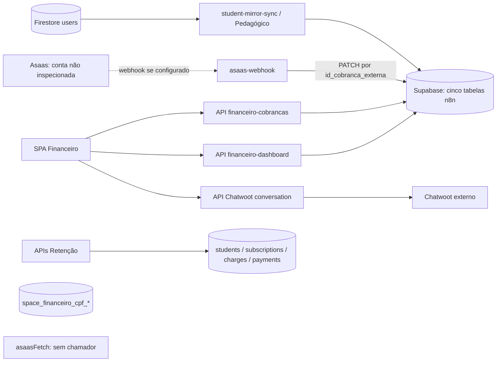
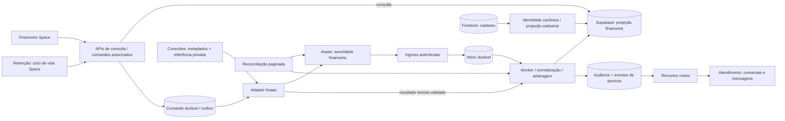

# Auditoria técnica e arquitetural — Financeiro Space

**Data:** 14/09/2026. **Etapa:** discovery, sem implementação. **Escopo:** checkout atual da plataforma Space e Supabase configurado localmente.

## Leitura executiva

A implementação encontrada é uma SPA JavaScript com CRUD financeiro direto no Supabase, um webhook Asaas que atualiza apenas cobranças já existentes e um workspace Chatwoot embutido. **Não é uma projeção confiável do Asaas.** O helper HTTP Asaas existe, mas não tem consumidores encontrados no código executável. Há ainda um segundo modelo financeiro no schema de Retenção e três estruturas de identidade por CPF, sem integração com o painel financeiro.

Principais evidências:

1. `PAYMENT_CREATED` é ignorado. Eventos reconhecidos sem cobrança local retornam sucesso com `updated: 0`.
2. A Space cria/edita/baixa cobranças somente localmente. Nenhuma dessas ações chama a API Asaas.
3. A troca de abas altera o estado/URL, mas o cache de 30 segundos retorna antes de renderizar. O conteúdo anterior permanece.
4. O schema consultado não possui `aluno_id`, `aluno_email` nem `firestore_doc_id` em cobranças, embora a API da ficha do aluno use esses campos.
5. As cinco tabelas do painel estavam vazias na consulta. Isso é um snapshot do banco configurado localmente, **não prova de ausência de cobranças na conta Asaas nem de equivalência com o deploy ativo**.
6. Não há inbox financeiro, deduplicação de eventos, backfill Asaas, reconciliação Asaas ou trilha transacional de auditoria nos handlers financeiros encontrados.

**Decisão recomendada:** implementar primeiro Financial Foundation em sandbox, com identidade, projeção, ingestão durável e reconciliação. A interface nova depende dessa base.

## Método, evidência e limites

- Leitura dos handlers, helpers, template, roteador, renderizadores, CSS, schemas SQL, regras Firestore, scripts, testes e documentação de arquitetura/Atendimento.
- Consulta **GET somente de leitura** ao OpenAPI PostgREST do Supabase de `.env.local`, contagens exatas com `limit=0` e duas sondagens de colunas com `select=...&limit=0`. Nenhum registro pessoal foi retornado por essas consultas.
- Secrets foram inspecionados somente por presença/ausência; seus valores não são reproduzidos. Os arquivos de ambiente locais não comprovam o ambiente atualmente implantado.
- Execução isolada de funções reais em VM, com transportes simulados, para reproduzir cache e webhook; nenhum webhook foi enviado à produção.
- 39 testes existentes passaram: `node --test tests/staging-env.test.js tests/student-ownership.test.js tests/retention-domain.test.js`. São testes locais de ambiente, identidade e Retenção; não certificam a integração financeira ponta a ponta.
- Não houve login no Asaas, consulta à conta, inspeção de workflows n8n externos, inspeção de logs de produção ou validação visual em sessão autenticada. A auditoria de UX é do template, CSS e fluxo de código; a reprodução da navegação foi isolada, não um teste completo de navegador.
- OpenAPI confirma colunas, tipos, obrigatoriedade e PK/FK quando anotadas. Não comprova todos os índices únicos, triggers, grants ou políticas RLS ativos. Quando há SQL versionado, distinguimos contrato SQL de configuração remota efetiva.
- O checkout já continha alterações de CRM e um documento de Atendimento. Foram preservados. O único entregável de produto desta tarefa é este Markdown.
- “Não encontrado” significa ausência no material auditado; não exclui automações privadas fora do repositório. Nomes com prefixo `n8n_` não provam execução de n8n.

## 1. Arquitetura financeira atual

| Camada | Implementação real | Situação |
| --- | --- | --- |
| Shell | `api/app.js`, `api/_templates/app.html`, `script.js`, `styles.css` | SPA compartilhada com os demais módulos, sem aplicação financeira separada |
| Rotas | `/financeiro` redireciona; `/app/admin/financeiro` e `/app/financeiro`, query `aba` | Navegação interna sobre um painel |
| Dados do painel | `api/financeiro-dashboard.js` | Lê cinco tabelas; escreve alunos/cobranças e vínculo Chatwoot |
| Ficha do aluno | `api/financeiro-cobrancas.js` | CRUD separado, com contrato incompatível com colunas remotas |
| Asaas | `api/asaas-webhook.js`, `api/_lib/asaas.js` | Webhook parcial; helper de saída sem chamadores |
| Conversas | `api/chatwoot/conversation.js` e renderizadores financeiros | Lê/envia mensagens e notas pelo backend |
| Cadastro | Firestore `users`, espelhos Supabase | Vínculo parcialmente implementado e inconsistente |
| Retenção | `api/retention-*.js`, `api/_lib/retention-*`, `supabase/retention-lifecycle-v2.sql` | Modelo operacional próprio, não sincronizado pelo webhook financeiro |
| Identidade CPF | Três tabelas `space_financeiro_cpf_*` no Supabase | Existem dados; não há consumidor operacional encontrado no Financeiro |

### Inventário de arquivos e classificação

| Arquivo/grupo | Uso e classificação |
| --- | --- |
| `api/_templates/app.html:501`, `:2094` | Sidebar e painel financeiro ativos; botões, seis tabs e seis containers |
| `script.js:12422` até funções Chatwoot | Estado, filtros, dashboard, tabelas, modais, mensagens; código ativo |
| `script.js:13300` e ficha administrativa | Consulta financeira por aluno; conectada, porém quebrada pelo schema |
| `script.js:24630`, `:36628`, `:36842`, `:37042`, `:38139`, `:39990` | Maps de URL, sidebar, showPanel e handlers duplicados |
| `api/_lib/finance-integrations.js` | Registro das cinco tabelas, RBAC, configuração Asaas e Chatwoot |
| `api/_lib/supabase-rest.js`, `api/_lib/http.js`, `_lib/session.js` | Transporte com service role, JSON e sessão |
| `api/_lib/asaas.js` | Adaptador incompleto/desconectado: exporta `asaasFetch`; busca de referências só encontrou definição/export |
| `api/_lib/student-mirror-sync.js` | Sincroniza cadastro Firestore em espelhos; não cria customers Asaas |
| `api/_lib/pedagogico-service.js`, `api/_lib/pedagogico-n8n.js` | Consumidores de aluno financeiro e cópias de status/IDs |
| `scripts/supabase-add-firestore-ref.sql` | Alteração histórica proposta para referências Firestore; parcialmente refletida no banco consultado |
| `supabase/retention-lifecycle-v2.sql` | Tabelas, RPCs, histórico, audit/outbox de Retenção existentes; não atribuir essas garantias ao Financeiro |
| `scripts/wipe-production-data.js`, `wipe-single-student.js`, `wipe-supabase.sql`, SQL de aluno específico | Scripts destrutivos legados que incluem tabelas financeiras; apenas lidos, nunca executados |
| `scripts/staging-seed.js`, docs de staging | Fixtures/planejamento; não constituem backfill ou reconciliação Asaas |
| `exports/controle-pedagogico/*` | Cópia exportada antiga com código financeiro; não é o template usado por `api/app.js`; eventual consumidor externo não verificado |
| `docs/DATA_MODEL.md`, `docs/ARCHITECTURE.md`, `docs/architecture/data-governance-rfc.md` | Evidência histórica/proposta; não prova de comportamento em execução |
| `docs/attendance-whatsapp-architecture.md` | Discovery de Atendimento usado para compatibilizar o futuro contrato |
| `api/health.js`, `_lib/runtime-env.js`, `api/runtime-config.js` | Presença de configuração/isolation e config pública; não verificam saúde financeira fim a fim |

Não há suíte dedicada de testes dos handlers Asaas/Financeiro encontrada. Testes de ownership/Retenção cobrem partes adjacentes. `financeState.logs` é preenchido, mas não há render/uso posterior encontrado: custo de carregamento sem produto correspondente. `data-sidebar-placeholder="true"` existe em cinco itens financeiros, mas não há interceptador desse atributo; **não é a causa comprovada da falha**.

## 2. Diagrama atual

Não existe aresta comprovada `criar cobrança Space → API Asaas`; nem `webhook → n8n_pagamentos_asaas_space`; nem `webhook → charges/payments da Retenção`.

## 3. APIs existentes e comandos

| API | Métodos/autorização | Efeito real |
| --- | --- | --- |
| `/api/financeiro` | GET/HEAD; sessão admin/Finance | Redirect para o painel |
| `/api/financeiro-dashboard` | GET; admin/Finance | Alunos 500, cobranças 500, logs 200, eventos 200, pagamentos 300; nenhuma paginação continuável |
| mesma API | POST/PATCH `save_aluno` | INSERT/PATCH local; nome obrigatório, ID Asaas editável sem validação externa |
| mesma API | `save_cobranca` | INSERT/PATCH local; exige apenas nome no handler, vencimento obrigatório no banco |
| mesma API | `confirm_cobranca` | Marca pago localmente, inclusive aceitando `ASAAS` como forma de confirmação |
| mesma API | `link_conversation` | Atualiza por ID, email ou nome; propaga para cobranças; pode atingir múltiplos registros |
| `/api/financeiro-cobrancas` | GET; admin/Finance | Por `aluno_id`, sem limite explícito nesse ramo; global limitado a 200 |
| mesma API | POST/PATCH | Salva cobrança local ou confirma manual; contrato diferente do dashboard |
| `/api/asaas-webhook` | POST; segredo compartilhado | Oito tipos de evento fazem PATCH; demais retornam ignored |
| `/api/chatwoot/conversation?id=...` | GET/POST; admin/Finance | Lista mensagens; envia outgoing ou nota privada; não cria conversa/contato |
| `/api/health` | Ver implementação compartilhada | Flags de env e isolamento; não testa API Key, fila, conta, sync ou webhook |
| `/api/runtime-config` | Config pública | Allowlist de ambiente/Firebase/features; não expõe secrets Asaas |

APIs adjacentes: `api/admin-data.js` e mirror-sync propagam cadastro; `api/retention-cases.js`, `retention-import.js`, `retention-churn-job.js` gerenciam ciclo de vida; `api/_lib/pedagogico-service.js` lê dados financeiros. Não há comando de criação/edição/cancelamento **remoto Asaas** nem endpoints financeiros de assinaturas, reconciliação ou conexão encontrados.

Os handlers financeiros consideram PATCH de zero linhas um sucesso em vários caminhos. `loadTable` transforma falha em array vazio com erro por tabela e resposta global 200. Isso permite UI parcialmente carregada, mas os KPIs não sinalizam de modo próprio que a base é incompleta.

## 4. Tabelas e estruturas existentes

### 4.1 Snapshot remoto consultado

As cinco tabelas `n8n_*` financeiras tinham **0 linhas**. Também tinham 0: `students`, `billing_accounts`, `subscriptions`, `service_periods`, `charges`, `payments`, `retention_cases`, `retention_events` e os três históricos de status. As tabelas CPF tinham: `space_financeiro_cpf_sources` **99**, `space_financeiro_cpf_identity` **1**, `space_financeiro_cpf_exceptions` **1**. Contagens não demonstram qualidade, correspondência com Asaas ou ausência de escritores externos.

O **Apêndice A** registra todas as colunas, tipos, campos obrigatórios e PK/FK expostas pelo OpenAPI das 25 estruturas financeiras/adjacentes inspecionadas, sem dados pessoais.

### 4.2 Cinco tabelas do painel

| Tabela | Responsabilidade e identidade | Status/tempo | Inconsistências |
| --- | --- | --- | --- |
| `n8n_alunos_financeiro_space` | Espelho cadastral/vínculos; PK bigint `id`; `firestore_doc_id`, customer/subscription Asaas, IDs DataCrazy e Chatwoot | `status` texto default ativo; created/updated; timestamps de vínculo | Nenhuma FK anotada; assinatura única embutida por linha; nome/email/telefone redundantes; campos de match sem consumidor no painel |
| `n8n_cobrancas_financeiras_space` | Cobrança local; PK bigint `id`; `id_cobranca_externa` texto | `status` texto; vencimento obrigatório; created/updated; `pago_em` | Sem customer/subscription, FK ou Firestore ID expostos; `forma_pagamento` mistura provedor e destino de pagamento; desconto existe mas não é integrado pelo handler |
| `n8n_pagamentos_asaas_space` | Espelho de pagamento/envelope externo; PK bigint `id`; payment ID obrigatório, customer/subscription opcionais | `status_asaas`, `evento_asaas`, data_pagamento date, created/updated | Sem escritor encontrado nos handlers; nome/email/telefone duplicados; raw_payload retornável ao browser; nenhuma FK anotada |
| `n8n_logs_cobranca_space` | Log de envio; PK bigint `id`; cobrança externa e tipo_aviso obrigatórios | enviado_em, created_at; status default enviado | Canal default chatwoot, origem n8n; mensagem e PII; não é auditoria de mudança financeira |
| `n8n_eventos_cobranca_space` | Resultado de aviso/workflow; PK bigint `id`; cobrança externa opcional | status_evento obrigatório, tipo_aviso, motivo, created_at | `workflow_execution_id` não equivale a ID de evento Asaas; nenhum before/after ou ator canônico |

**Ausências confirmadas em cobranças:** `aluno_id` e `firestore_doc_id` responderam 400/42703 em GET sem dados; `aluno_email` também não consta do schema. O endpoint por aluno consulta `aluno_id`, portanto falha nesse banco. O builder dessa API sempre inclui `firestore_doc_id` mesmo nulo: suas escritas também são incompatíveis. O dashboard usa `email`, mas descarta `aluno_id` que o modal envia. `link_conversation` também inclui a coluna Firestore ausente ao atualizar cobranças. `scripts/supabase-add-firestore-ref.sql` não é prova de aplicação bem-sucedida em todas as tabelas.

Mirror-sync tenta gravar `plano`, `professor_id`, `professor_nome`, `ativo` no aluno financeiro; essas colunas não constam do schema remoto. A rotina captura erro e não constitui uma sincronização cadastral garantida. Há conflito ainda entre `ativo` boolean esperado por espelho e `status="ativo"` usado pelo painel.

### 4.3 Identidade por CPF

- `space_financeiro_cpf_sources`: fontes brutas, PK bigint, sistema/ID externo obrigatórios, CPF validado/mascarado, IDs Asaas/DataCrazy/plataforma, raw_payload e synced/created/updated.
- `space_financeiro_cpf_identity`: PK **CPF em texto**, atributos pessoais, IDs dos três sistemas, match_status/notes, last_*_sync_at, três payloads brutos.
- `space_financeiro_cpf_exceptions`: PK bigint, tipo/severidade, identificação da fonte, CPF/PII, descrição, raw_payload, resolvido/por/em e criação.

Nenhuma FK aparece nas definições. Não foi identificado serviço ativo no painel que as resolva. A existência de `last_asaas_sync_at` não comprova job rodando. CPF identifica pessoa/pagador, não matrícula: não promover CPF a PK canônica do aluno. Auditar proveniência e escritores externos antes de reaproveitar; não remover as 99 fontes nem as exceções.

### 4.4 Retenção, cobrança e auditoria já estruturadas

`supabase/retention-lifecycle-v2.sql` contém:

- `students`: UUID, `firestore_student_id` único, cadastro espelhado, lifecycle/pause e versão.
- `billing_accounts`: pagador operacional, `external_key` único, origem/confiança.
- `subscriptions`: FK student/billing account, external_subscription_key, ciclo/plano, lifecycle/pause/**financial_status**, MRR e conversão cambial; chave `(student_id, external_subscription_key)` no SQL.
- `service_periods`: intervalos por subscription com unicidade de período.
- `charges`: FKs opcionais subscription/billing_account, external_charge_id único no SQL, charge_status, due_at, valores/moeda/período/payload/versão.
- `payments`: FKs charge/subscription, external_payment_id único no SQL, paid_at/status/valores/payload/versão.
- `retention_cases`, `retention_events`: caso com dono e marcos; eventos com ator, idempotency_key, fingerprint, before/after. Triggers append-only declarados no SQL.
- `subscription_status_history`, `pause_status_history`, `financial_status_history`: histórico por subscription/evento.
- `audit_logs`, `outbox_events`: infraestrutura usada por Retenção; outbox tem status/tentativas/agendamento/erro, não inbox de Asaas.
- `monthly_base_snapshots`, `kpi_formula_versions`, `kpi_monthly_snapshots`, `data_quality_snapshots`: base histórica, fórmulas e qualidade.

O provisionamento de Retenção pode usar `external_subscription_key="firestore:<id>"` (`retention-store.js:167`): **não é ID de assinatura Asaas**. Comandos `delinquency_started/recovered` alteram financial_status por lógica Space, sem webhook Asaas conectado. Não renomear nem substituir essas tabelas antes de definir adapter e ownership por campo.

### 4.5 Outras cópias

`n8n_onboarding_alunos_space`/schema pedagógico copiam status_financeiro, pagamento_status, IDs Asaas e Chatwoot (`pedagogico-n8n.js:177`, `supabase/pedagogico-operacao-v2.sql`). Firestore `users` guarda cadastro, plano, valorMensalidade e estado de cancelamento; `contratos` é contratação comercial/documental, não confirmação de recebimento. `classes` é relacionamento pedagógico. Oportunidade/receita comercial em Growth não deve ser contabilizada automaticamente como recebimento financeiro.

## 5. Ownership atual

| Informação | Escritor efetivo encontrado | Diagnóstico |
| --- | --- | --- |
| Cadastro aluno | Firestore; edição do espelho pelo Financeiro; mirror-sync | Intenção canônica Firestore, mas escritas concorrentes de nome/email/telefone |
| Valor/vencimento/status local | CRUD Space e webhook Asaas | Estados concorrentes, sem arbitragem/versionamento |
| Customer/subscription ID | Texto enviado pelo frontend | Referência não validada nem escopada por conta/ambiente |
| Pagamento confirmado | Operador Space ou webhook parcial | Sem garantia de equivalência com liquidação Asaas |
| Ciclo de vida | Firestore legado + Retenção Supabase | Precisará contrato de autoridade entre versões antes de integração Financeiro |
| Mensagens | Chatwoot via proxy Space | Financeiro assume UX/engine de conversas que deverá pertencer a Atendimento |
| Status financeiro Retenção | Comandos/RPCs de Retenção | Outra representação sem convergência com o painel |

O RFC de governança diz que Supabase é fonte oficial de `asaas_customers/charges`; isso precisa ser refinado: Supabase é o **armazenamento da projeção**, Asaas é autoridade dos fatos externos. O documento histórico `DATA_MODEL.md` atribui escrita de pagamentos ao webhook; o handler atual não faz isso. Prioridade da evidência: código + schema consultado acima das descrições históricas.

## 6. Integração Asaas atual e configuração

- API Key esperada em `process.env.ASAAS_API_KEY`; enviada como header `access_token` exclusivamente pelo helper server-side.
- Base em `ASAAS_BASE_URL`; fallback `https://api-sandbox.asaas.com/v3`. `_lib/runtime-env.js` valida isolamento, mas usa a env explícita; base omitida pode escapar da checagem de produção e depois cair no fallback sandbox do helper.
- Nas cópias `.env.local` e `.env.vercel.pull`, **ASAAS_API_KEY e ASAAS_BASE_URL não estão presentes**, nem ASAAS_WEBHOOK_TOKEN/SECRET; N8N_WEBHOOK_SECRET está vazio. Chatwoot token também vazio. Não afirmar “conectado em produção”. Chaves/config externas ao checkout não foram verificadas.
- `.env.example` e `.env.staging.example` incluem ASAAS_API_KEY/BASE_URL/KEY_SCOPE. Token dedicado de webhook Asaas não está documentado nesses exemplos; código aceita TOKEN → SECRET → N8N_WEBHOOK_SECRET.
- `asaasFetch` faz fetch, parse e propaga erro; não possui timeout, retry, backoff, paginação, auditoria, circuit breaker ou idempotência. **Nenhum endpoint Asaas é consumido por um chamador encontrado**.
- Webhook `/api/asaas-webhook`: autentica segredo e faz PATCH em cobrança por payment.id. Não valida contra API Asaas, não resolve customer/aluno/subscription, não persiste envelope.
- `api/health.js` só verifica variáveis. Pode considerar webhookProtection configurado por segredo de outro provedor; não é medição da entrega Asaas.
- Supabase: SUPABASE_URL/NEXT_PUBLIC_SUPABASE_URL e SERVICE_ROLE_KEY/SERVICE_KEY; service role só no backend. Chatwoot: BASE_URL, ACCOUNT_ID, INBOX_ID, API_TOKEN, com defaults de host/conta/inbox no helper e host/conta fixos também no frontend.
- Variáveis adjacentes: APP_ENV/SPACE_APP_ENV, ASAAS_ENV/KEY_SCOPE, referências SPACE_PRODUCTION_*/SPACE_STAGING_*, SPACE_AUTH_SECRET, credenciais Firebase server-side, N8N_* e flags RETENTION_*.
- `.env.local` e `.env.vercel.pull` não aparecem como arquivos versionados na consulta; `.env*` é ignorado. Não foi auditado histórico Git completo nem distribuição passada de secrets.

## 7. Eventos Asaas tratados

Para todos os eventos abaixo: só existe efeito se já houver cobrança local com `id_cobranca_externa` correspondente. Não há INSERT, gravação em pagamentos, event log ou atualização de assinatura.

| EVENTO ASAAS | TRATADO HOJE? | EFEITO ATUAL | PROBLEMA |
| --- | --- | --- | --- |
| PAYMENT_CREATED | Não | 200 ignored | Cobrança criada diretamente no Asaas não entra |
| PAYMENT_UPDATED | Parcial | valor, vencimento, links não vazios; subset de status | Não projeta PENDING/AUTHORIZED/etc.; não limpa links/paid_at antigos; não projeta billingType, customer, subscription |
| PAYMENT_CONFIRMED | Sim, parcial | status pago, pago_em, forma_confirmacao ASAAS | Confunde confirmação com dinheiro disponível |
| PAYMENT_RECEIVED | Sim, parcial | mesmo patch de confirmado | Não insere pagamento; sem liquidação independente |
| PAYMENT_OVERDUE | Sim, parcial | status vencido e updated_at | Não remove pago_em nem trata ordenação |
| PAYMENT_DELETED | Sim, parcial | status cancelado | Não preserva evento de exclusão; não remove pago_em |
| PAYMENT_REFUNDED | Sim, parcial | status cancelado | Perde semântica e valor estornado; UI pode seguir contando pago |
| PAYMENT_CHARGEBACK_REQUESTED | Sim, parcial | status cancelado | Disputa confundida com cancelamento |
| PAYMENT_CHARGEBACK_DISPUTE | Sim, parcial | status cancelado | Sem estado próprio de disputa/evolução |

O mapper reconhece também os **status** RECEIVED_IN_CASH e REFUND_REQUESTED dentro de PAYMENT_UPDATED. Não são novos handlers de eventos. Valor ausente é eliminado do patch; `value=null` vira 0 por Number(null), outro motivo para validação estrita futura.

## 8. Eventos não tratados

Todos os tipos não listados no handler retornam 200 ignored. Conforme catálogo oficial consultado, faltam, entre outros:

| Evento/grupo | Tratado hoje? / efeito | Problema |
| --- | --- | --- |
| PAYMENT_RESTORED | Não / ignored | Restauração não desfaz cancelamento local |
| PAYMENT_PARTIALLY_REFUNDED | Não / ignored | Saldo e estorno parcial ausentes |
| PAYMENT_REFUND_IN_PROGRESS, PAYMENT_REFUND_DENIED | Não / ignored | Processo de estorno sem acompanhamento |
| PAYMENT_RECEIVED_IN_CASH_UNDONE | Não / ignored | Reversão pode deixar baixa local incorreta |
| PAYMENT_AWAITING_CHARGEBACK_REVERSAL | Não / ignored | Recuperação da disputa invisível |
| PAYMENT_CREDIT_CARD_CAPTURE_REFUSED | Não / ignored | Fila de falhas não pode ser confiável |
| PAYMENT_AUTHORIZED | Não / ignored | Autorização não representada |
| PAYMENT_AWAITING_RISK_ANALYSIS, PAYMENT_APPROVED_BY_RISK_ANALYSIS, PAYMENT_REPROVED_BY_RISK_ANALYSIS | Não / ignored | Análise/recusa de risco invisíveis |
| PAYMENT_ANTICIPATED | Não / ignored | Data de caixa/antecipação sem projeção |
| PAYMENT_DUNNING_RECEIVED | Não / ignored | Recebimento associado a negativação não integrado |
| PAYMENT_BANK_SLIP_CANCELLED | Não / ignored | Cancelamento do registro de boleto sem distinção da cobrança |
| Eventos de customer/assinatura e demais domínios | Nenhum dispatch encontrado | Cadastro externo/assinatura não convergem; fechar allowlist com contrato oficial antes de implementar |

Essa lista é priorização, não whitelist para descarte. O futuro ingress deve guardar desconhecidos com classificação/revisão, sem aplicar efeitos financeiros inventados. O catálogo pode evoluir. [Fonte oficial dos eventos de cobrança](https://docs.asaas.com/docs/webhook-para-cobrancas).

## 9. Problemas de sincronização

| Ação | Resultado comprovado pelo código atual |
| --- | --- |
| Criar no Asaas | PAYMENT_CREATED ignorado; não há importador encontrado |
| Alterar no Asaas | Atualiza subset apenas se cobrança local existir e webhook estiver configurado/autenticado |
| Pagar no Asaas | Marca cobrança local; não alimenta tabela de pagamentos; CONFIRMED/RECEIVED colapsam |
| Excluir no Asaas | Marca cancelado local, sem tombstone/evento imutável |
| Estornar/disputar | Alguns eventos marcam cancelado; outros são ignorados; pago_em pode permanecer |
| Criar na Space | Registro apenas local com provedor padrão ASAAS; não existe criação externa |
| Editar/baixar na Space | Estado local alterado; Asaas permanece igual |

O refresh da UI recarrega Supabase; **não sincroniza Asaas**. Não há realtime financeiro. Exceção/sucesso parcial pode produzir aparência de zero. A ausência de API Key no ambiente local impede inclusive validar uma reconciliação externa hoje.

## 10. Idempotência e duplicidade

- Não usa `body.id` do evento para dedupe. Reentrega regrava updated_at; sem data de pagamento no evento, pode regravar pago_em com horário atual.
- Eventos atrasados podem reverter estado; não há versão externa, bloqueio ou consulta para arbitragem. Não basta uma ordem monotônica de status: estornos/restaurações são transições legítimas.
- POST de cobrança sem ID insere novamente em cada tentativa. Não há client_action_id, fingerprint ou lock de comando.
- Unicidade de `id_cobranca_externa` nas tabelas legadas não é demonstrada pelo OpenAPI; não afirmar que inexiste no banco. O código não garante dedupe e um PATCH pode afetar várias linhas se duplicatas forem permitidas.
- Risco comprovável é duplicação **local** e divergência. Não há caminho de criação remota encontrado para provar duplicação automática no Asaas; risco externo depende de workflows não inspecionados e da implementação futura.

## 11. Reconciliação atual e lacunas

Não foi encontrado job Asaas de initial sync, full scan, atualização incremental, comparação de divergências ou reprocessamento. Não há cron financeiro em `vercel.json`. Os módulos “reconciliation” pedagógicos/identidade não conciliam a API Asaas. Tabelas CPF com timestamps também não demonstram job operacional.

O provider entrega eventos pelo menos uma vez e pode repetir entregas não-2xx; portanto o sucesso 200 para registro ausente encerra a tentativa externa sem recuperar a cobrança. Isso não equivale a retry local nem a dead letter. [Contrato oficial de entrega](https://docs.asaas.com/docs/receive-asaas-events-at-your-webhook-endpoint).

## 12. Identidade aluno ↔ Asaas

- Cadastro canônico atual: document ID de Firestore `users`; não presumir igualdade com Firebase Auth UID ou aliases alunoId/studentId.
- Aluno financeiro: PK bigint separada; customer/subscription IDs são strings livres. Modal de aluno financeiro não exige vínculo canônico Firestore.
- Modal de cobrança envia aluno_id, mas dashboard ignora e a API da ficha consulta coluna ausente. Nenhuma validação de existência do aluno/customer é feita.
- `financeOpenCharge` casa por email **ou** telefone **ou** nome; pode cruzar homônimos/pagadores compartilhados. `link_conversation` também escreve por nome/email. O sensor `resolveStudentFinanceBinding` usa IDs e fallbacks textuais com garantias diferentes. Pedagógico rejeita parte das ambiguidades, mas essa proteção não vale para todos os fluxos.
- `financeChatFinancialSummary` agrega por conversa/atributos; uma conversa não é identidade financeira.

**Futuro:** pagador distinto de aluno. `(connection_id, asaas_customer_id)` identifica cliente externo; ponte explícita pagador ↔ aluno/matrícula com origem, validade e ator. Uma cobrança pode alocar valor a vários alunos; um aluno pode ter mais de um pagador/contrato ao longo do tempo. Nome nunca decide vínculo. Email/telefone/CPF apenas sugerem candidatos; casos ambíguos vão a revisão. Customer sem aluno deve ser sincronizado e marcado “não vinculado”, sem perder o evento.

## 13. UX atual e causa das telas iguais

### Causa funcional comprovada

1. Clique em sidebar/tab define `financeState.activeTab` e chama `navigateFinanceState` (`script.js:38139`, `:39990`).
2. `navigateApp` parseia `?aba=...`, aplica estado e chama `showPanel`.
3. `showPanel("financeiro")` chama apenas `ensureFinanceLoaded({force:false})` (`:36842`).
4. `ensureFinanceLoaded` retorna quando loadedAt tem menos de 30 segundos, **antes** de `renderFinancePanel` (`:12688`).
5. Containers `hidden` são ajustados em `renderFinanceTabs`, chamado pelo render, que não acontece nesse caminho. Sidebar/URL podem mudar com conteúdo antigo.

VM com função real: cache recente + aba cobrancas ⇒ **0 renders, 0 fetches**; force refresh ⇒ **2 renders, 1 fetch**. A recuperação inicial em load chama render, mas não corrige cliques subsequentes. Após 30 segundos, próximo clique pode recarregar/renderizar; não existe timer que resolva automaticamente aos 30 segundos.

Não são seis páginas apontando acidentalmente para o mesmo HTML: são seis datasets/views intencionais num painel, com invalidação visual incorreta. `[hidden] {display:none!important}` está presente; não há evidência de CSS anulando a ocultação. Os handlers financeiros duplicados são dívida de manutenção, não causa necessária dessa reprodução.

### Arquitetura de informação e componentes

| Regra | Violação atual | Direção futura |
| --- | --- | --- |
| Módulo = domínio | Conversas/credenciais misturam responsabilidades | Financeiro, Atendimento e Conexões com contratos claros |
| Submódulo = workspace | Eventos técnicos promovidos a workspace; pagamentos duplicam parte de recebíveis | Recebíveis como trabalho diário; histórico no detalhe |
| Tab/filtro = mesmo dataset | Menu e tabs repetem navegação entre datasets distintos | Uma navegação de workspaces; tabs de status dentro de Recebíveis |
| Drawer = detalhe | Edição extensa e conversa em modal | Drawer de cliente/cobrança/assinatura com histórico |
| Modal = ação curta | Formulário de cobrança com IDs/links técnicos e conversa longa | Modal só para comando pequeno e confirmação contextual |
| Botão = comando contextual | Adicionar usuário, atualizar, nova cobrança em todo o módulo | Criar cobrança no workspace/cliente; sync em Conexões |

`Adicionar usuário` abre criação de **espelho financeiro**, não cadastro canônico nem criação de acesso; o rótulo induz interpretação errada. Sete cards iguais permanecem sobre todos os workspaces. Vários botões por linha, IDs técnicos em colunas principais, Chatwoot como requisito de “pronto para cobrança” e mapa decorativo por localização/DDD aumentam ruído.

Loading apaga tabelas e mostra texto, embora já existam skeletons globais. Empty state genérico compartilha casos de base vazia e falha parcial; totais podem continuar mostrando zero/stale. Há estados vazios por filtro e erro de carregamento — não é ausência completa de tratamento. Falta paginação server-side, busca abrangente e ordenação operacional. Tabelas são grids de div/span: revisar semântica/acessibilidade, foco/teclado, títulos de tab e associação com painel na V1.

### Design system a preservar

`styles.css:1` define Plus Jakarta Sans para corpo, Comfortaa importada; tokens de fundo #070910, painéis escuros #111b28/#152233, texto #f4efe7 e coral #ff564f. Sidebar 88/268px, gutter responsivo 18–34px; raios 14/18/24/32px. Reutilizar `.button`, `.button-outline`, `.button-solid`, `.modal-input`, badges de status, cards e drawers administrativos/pedagógicos, além de `.platform-skeleton` (`:23630`). Financeiro já possui estilos próprios de tabelas/cards/chat (`:6498` em diante), com tamanhos/pesos e cores locais; consolidar tokens/densidade sem redesign de marca. Padronizar spacing em escala pequena, menus overflow e foco visível, sem depender só da cor.

## 14. Legados e destino recomendado

| Legado | Dependências | Destino futuro |
| --- | --- | --- |
| Chatwoot proxy/modais/workspace/polling 15s | UI Financeiro, links na ficha, n8n externo possível | Adaptar chamada a Atendimento; retirar só após paridade e observabilidade |
| id_conversa_chatwoot, chatwoot_contact_id, match_method/vinculado_at | Aluno/cobrança/onboarding, vínculos manuais | Preservar em tabela de mapeamento legado; não usar como chave de aluno |
| Host/conta Chatwoot fixos | helper e frontend | Metadados por conexão/canal no Atendimento |
| n8n_logs/eventos e workflow_execution_id | Evidência de avisos externos | Histórico legado somente leitura, com origem e retenção definida |
| payment methods CPF_GUILHERME/XP/PIX_MANUAL/OUTRO | Baixa manual | Levantar significado operacional; distinguir recebimento externo/manual, não fingir liquidação Asaas |
| exports e scripts de wipe | Distribuição histórica/manutenção | Inventariar consumidores e retirar de caminhos de deploy/rotina após revisão; não executar para migrar |
| Tabelas CPF | Dados reais e possível processo externo | Preservar proveniência e exceções; migrar somente vínculos validados |

## 15. Dívidas técnicas e segurança

| Prioridade | Evidência | Impacto/ação futura |
| --- | --- | --- |
| P0 | CRUD local de status/valor/vencimento com provedor ASAAS | Estado concorrente; substituir por comandos remotos auditáveis |
| P0 | Webhook ignora created e missing row | Perda permanente de eventos; ingress durável + upsert/reconciliação |
| P0 | Colunas divergentes entre API e schema | Ficha e escritas falham; contrato validado em sandbox antes da V1 |
| P0 | Confirmação manual/status pago diretamente editável | Usuário Finance pode marcar pago sem evidência externa; capacidade específica, justificativa e regra de provider |
| P1 | Sem idempotência/ordenação/retry local | Duplicidade e regressão de estado |
| P1 | Join por nome/email/telefone | Dados/contatos financeiros de aluno errado |
| P1 | Cache bloqueia render | Operação confusa e erro de contexto |
| P1 | SELECT * e retorno `...row` | PII, raw_payload e metadados internos enviados além do necessário |
| P1 | service_role sem autorização por objeto/conta | RBAC amplo; credencial privilegiada depende totalmente do backend |
| P1 | Webhook aceita query token/secret e fallback de outro provedor | Segredo pode circular em URLs/logs; isolamento de segredo por conexão necessário |
| P1 | Console de erros com error.data/filtros/PII | Redação e retenção de logs ausentes; minimizar exposição |
| P2 | Dois builders/handlers equivalentes com semântica diferente | Uma correção pode não alcançar todos os caminhos |
| P2 | Auditoria/logs locais não transacionais | Não reconstitui quem alterou antes/depois |

Controles presentes: sessão assinada HS256 com comparação timing-safe; cookie HttpOnly/SameSite=Lax/Secure conforme request; gates admin/FINANCE (incluindo aliases) nas APIs; segredo obrigatório no webhook (503 se ausente, 401 se inválido); allowlist pública de config e respostas no-store. O fallback de segredo de sessão de desenvolvimento depende de NODE_ENV/VERCEL_ENV corretos. A API financeira não revalida capacidades por ação nem vínculo do objeto com conta/conexão.

`financeiro-cobrancas` bloqueia confirmar_pagamento com método ASAAS, mas permite `status="pago"` em salvamento comum; `confirm_cobranca` do dashboard aceita ASAAS. Não há aprovação/justificativa/ator UID consistente, e confirmado_por usa nome/email mutável. Não há validação forte de valores positivos, identidade externa, URLs https permitidas ou estados de transição. Escaping HTML existe, mas escaping de atributo não equivale a validação de protocolo de link. Não foi feita exploração de vulnerabilidades.

**LGPD técnica:** CPF bruto/mascarado, telefone, email, mensagens, dados financeiros e raw_payload estão em múltiplas estruturas. Definir finalidade, acesso mínimo, mascaramento/exportação, retenção por categoria e trilha de consulta sensível. Não é parecer jurídico nem comprovação de violação legal. Políticas RLS/grants remotas do legado permanecem pendentes: leitura com service role não valida acesso anon/authenticated. O SQL de Retenção revoga acesso desses papéis, mas não resolve o legado automaticamente.

## 16. Arquitetura financeira proposta

Separar módulos no código por domínio: adapter/projeção financeira, comandos, ingestão, reconciliação, consultas, identidade e integração Atendimento. Manter a infraestrutura existente de SPA/Vercel, mas retirar lógica financeira do monólito gradualmente. Worker com persistência/lease e scheduler explícitos: execução em segundo plano dentro do request serverless não é garantia de processamento.

Não implementar event sourcing completo de toda a plataforma para resolver o Financeiro. Precisamos de eventos duráveis, projeção reproduzível e auditoria transacional. O estado Asaas atual pode reparar a projeção; o histórico Space continua separado e preservado.

## 17. Source of truth proposto — matriz formal

| Dado | Autoridade | Armazenamento/projeção Space | Comando permitido |
| --- | --- | --- | --- |
| Customer financeiro, CPF/CNPJ de cobrança, contato fiscal | Asaas | Customer por conexão/conta | Space solicita alteração remota; cadastro do aluno não sobrescreve automaticamente |
| Cobrança: ID, valor, vencimento, método, invoice/boleto, descontos/juros/multa | Asaas | Projeção de recebível e saldo | API Asaas, confirmação e reconciliação |
| Assinatura financeira: ciclo/valor/status/cobranças | Asaas | Projeção da assinatura externa | API Asaas; distinta da assinatura/serviço pedagógico Space |
| Confirmação, liquidação, estorno, disputa, vencido | Asaas | Status bruto + estado operacional derivado + movimentos | Nunca editar fato externo diretamente no Supabase |
| Aluno, dados cadastrais e matrícula | Space/Firestore no contrato atual | Referência canônica e cache mínimo | Fluxo cadastral Space |
| Pagador ↔ aluno, alocação, vínculo com contrato | Space | Supabase com FKs/proveniência/vigência | Comando de vínculo auditado; nunca por nome |
| Ciclo de vida, aviso prévio, cancelamento do serviço | Space/Retenção | Modelo operacional Supabase; ponte com Firestore legado | Um único serviço de ciclo de vida deve arbitrar versões |
| Plano acadêmico/comercial, CS, retenção, pedagogia | Space | Entidade proprietária e referências | Não inferir cancelamento acadêmico apenas de chargeback |
| Status agregado de inadimplência | Derivado de Asaas e política Space | Projeção com fórmula/versão | Não sobrescrever manualmente um status da cobrança |
| Recovery, promessa, responsável, última ação | Space | Casos/tarefas/interações | Eventos de domínio auditados |
| Conteúdo/estado de conversa | Atendimento | Referência/conversa/contexto mínimo no Financeiro | Mensagens exclusivamente via Atendimento |
| Conexão/credenciais | Configurações globais | Metadados públicos sanitizados + segredo privado | Capacidade administrativa de conexões |

Asaas é autoridade dos dados **que de fato administra**, não do cadastro acadêmico. Se houver recebimento fora do Asaas, definir política explícita: registrar externamente pela operação suportada após validação, ou manter entidade de recebimento externo com origem própria e reconciliação. Nunca etiquetar baixa manual como `ASAAS` sem comprovação remota. A definição dessa exceção é requisito da Fase 2.

Firestore não deve armazenar uma segunda coleção de cobranças com status editáveis. Retenção não deve fingir que `external_subscription_key="firestore:..."` representa uma assinatura financeira. O proprietário de ciclo de vida continua sendo Space; a migração entre legado Firestore e Retenção precisa ser explícita, sem duas autoridades permanentes.

## 18. Modelo de sincronização e reconciliação proposto

### 18.1 Ingestão durável e projeção

1. Resolver conexão e ambiente; autenticar com segredo específico no header; limitar tamanho e validar envelope.
2. Persistir inbox com `unique(connection_id, external_event_id)` e hash do envelope. Mesmo ID com conteúdo divergente é incidente, não sobrescrita silenciosa.
3. Responder 2xx **somente após persistência durável**. Se persistência falhar, responder erro para permitir reentrega. Duplicata já persistida recebe sucesso.
4. Worker adquire lease, resolve payment/customer/subscription, valida snapshot e faz upsert por `(connection_id, external_id)`.
5. Cobrança sem aluno é preservada como não vinculada; erro de identidade não impede receber o fato financeiro.
6. Atualização da projeção, auditoria e outbox de domínio na mesma transação local. Não existe transação atômica entre Asaas e Supabase: usar comando/estado de processamento.
7. Processar conflitos por objeto com serialização/versão local. Evento antigo ou contraditório aciona leitura do objeto no Asaas; manter evidência do evento sem reverter cegamente a projeção. `dateCreated` do evento e `received_at` têm papéis distintos; timestamp sozinho não basta.
8. Retry com backoff/jitter para falhas transitórias e 429 respeitando orientação do provedor; erros permanentes vão a fila de revisão. Lease expirado recupera crash; reprocessamento preserva evento original e registra operador/motivo.
9. Desconhecidos ficam `unsupported/review`; não bloquear toda a fila por um evento novo. Envelope bruto privado com retenção definida, sem vazar pela API operacional.

Manter separados status bruto Asaas, status de cobrança, disponibilidade do caixa, estorno/disputa, deletado e estado de sync. `CONFIRMED` não entra no KPI “recebido disponível”; decidir interrupção de régua por confirmação com regra explícita (ver seção 23), nunca por colapso de estados.

### 18.2 Comandos Space → Asaas

- API exige autorização, alvo canônico, justificativa quando cabível e chave do cliente; persistir command/fingerprint/result antes de despachar.
- Mesmo request key com mesmo payload retorna operação existente; mesma key com payload diferente é conflito.
- Criar/editar/cancelar/vencimento chamam adapter Asaas. Enquanto pendente, UI apresenta **operação em processamento**, não cobrança externa confirmada.
- Resposta externa validada atualiza projeção via serviço comum; webhook e reconciliação consolidam por mesmo ID, sem inserir duplicata.
- Timeout após possível sucesso remoto ⇒ estado `unknown`, consultar/correlacionar antes de repetir. Não presumir suporte universal a header de idempotência na API Asaas. Validar garantias por endpoint. `externalReference` pode ajudar a localizar, mas não é prova de unicidade imposta pelo provedor.
- Serializar comandos críticos por objeto, controlar versão, evitar update sobre estado stale. Auditoria registra solicitação, resultado/erro e efeito real.

### 18.3 Initial sync/backfill

- Validar conta/ambiente/API e escopo de acesso. Registrar conexão e início de execução com parâmetros/versionamento.
- Ativar inbox antes da varredura para não abrir janela sem eventos. Enumerar customers, subscriptions e payments conforme endpoints oficiais aprovados para conta.
- Paginar `/payments` com offset/limit (máximo documentado 100) e condição de continuação da resposta. Salvar checkpoint só depois do commit do lote; retomar sem duplicar.
- Para evitar movimentação de páginas perder dados, usar janelas fechadas de criação quando disponíveis, dedupe por ID e segunda passagem de sobreposição. Consulta por data de criação não captura toda alteração posterior.
- Preservar órfãos externos; validar relacionamentos; comparar contagem e somas por status/período; produzir relatório de divergência.
- Reprocessar inbox concorrente e executar segunda reconciliação antes de declarar corte estável. Cadastros/assinaturas sem timestamp de corte adequado exigem nova varredura/checagem por ID.

### 18.4 Incremental e full reconciliation

**Não assumir endpoint “updated since X”.** A referência de `/payments` consultada oferece filtros por criação, recebimento e vencimento, mas não documenta um filtro geral updatedAt. Incremental principal será webhook + consultas de reparo; reconciliação periódica por conjuntos/janelas e IDs conhecidos cobre alterações antigas. [Listagem oficial e filtros](https://docs.asaas.com/reference/listar-cobrancas).

| Estratégia | Proposta inicial / cobertura |
| --- | --- |
| Webhook | Caminho principal de atualização, continuamente processado |
| Reparação rápida | Pendências/unknown/missing mapping e divergências, a cada poucos minutos conforme volume/limites |
| Conciliação diária | Todas as cobranças abertas/atrasadas, janelas recentes de criação/recebimento e casos ativos |
| Full reconciliation | Varredura rotativa de todo o histórico por conexão, frequência ajustada ao volume; conferir também IDs locais ausentes na enumeração |
| Faltante local | ID externo encontrado sem projeção → upsert + auditoria |
| Status/valor divergente | Releitura do objeto, patch de campos Asaas e auditoria; preservar campos Space |
| Duplicidade | Unique externo; legado duplicado gera exceção/revisão, sem apagar/mesclar silenciosamente |
| Ausente no remoto | Não concluir exclusão por página/filtro incompleto; verificar objeto, tombstone/evento e política de erros 404/deletado |
| Reprocessamento | Por evento, objeto e sync run; simulação/diff, motivos, tentativas e resultado |

Não usar apenas janela “últimos 30 dias”: uma cobrança antiga pode receber estorno tardio. Full scan deve considerar objetos deletados conforme contrato real do endpoint e checagem de IDs; documentar o que a API não permite reconstruir retrospectivamente.

Indicadores: last_successful_sync_at, cobertura do backfill, maior idade da inbox, lag por objeto, eventos com erro/unsupported, quantidade e valor de divergências, last_reconciled_at por entidade. Falta de webhook recente pode significar ausência de movimento: diferenciar “sem eventos recentes” de “quebrado”.

## 19. Configurações > Conexões > Asaas

Hoje `ADMIN_SETTINGS_SECTIONS` lista integrações/conexões, mas `renderAdminSettingsPanel` usa placeholder para essas áreas. Perfil/acessos existentes não constituem gerenciador de credenciais.

Adotar **a mesma entidade `connections` proposta no discovery de Atendimento**, não duas tabelas com significado igual. Campos mínimos: id, provider, environment, account_reference, label, status, config não secreta, credential_reference, created/updated e atores. Unicidade/escopo por instalação/conta/ambiente. Segredo em secret manager ou armazenamento cifrado privado, com versão e rotação; nunca plaintext em tabela pública/PostgREST nem no runtime-config.

| Exibição | Evidência necessária |
| --- | --- |
| Conectado / degradado / erro / desconectado | Última validação real e erro sanitizado; não apenas env preenchida |
| Ambiente e conta | Base configurada + identificação confirmada pelo provedor |
| Última sincronização | Último run concluído, cobertura/contagens e lag |
| Último webhook | Último recebido autenticado, último processado e backlog distintos |
| Webhook operacional | Configuração externa + entrega/processamento conhecido; sem fingir teste se não houve evento |
| Erros recentes | Códigos e correlação, sem tokens/payloads pessoais |
| Sincronizar agora | Enfileira job idempotente com progresso; não varre tudo no request |
| Gerenciar | Capacidades de credencial/rotação/desconexão segregadas |

APIs futuras: `GET /api/connections`, `GET /api/connections/:id/health`, `POST .../:id/validate`, `POST .../:id/sync`, operações privadas de credencial/rotação. Retornar apenas metadados sanitizados; credencial enviada pelo administrador nunca volta na resposta. Admin de conexões pode diferir de operador Finance. Desconexão suspende comandos/despacho e preserva inbox/histórico com estado explícito.

Compatibilidade Atendimento: compartilhar metadados, authz, auditoria, health e padrão de jobs; credencial/secreto/parser por provedor. Meta exige verificação própria, Asaas segredo próprio. Não reutilizar o segredo n8n ou autenticação Meta entre conectores. WhatsApp usa `channels` sob conexão; Asaas usa conta/projeção financeira, não canal de mensagens.

## 20. Submódulos futuros, dados e métricas

A proposta **Visão Geral, Recebíveis, Assinaturas, Clientes, Recuperação, Relatórios** faz sentido. Lançar os quatro primeiros na V1; Recuperação e Relatórios entram quando houver dados/fluxos reais, sem placeholders operacionais. Pagamentos/estornos ficam no contexto do recebível e nos relatórios de caixa, preservando acesso ao detalhe; Eventos vira histórico técnico/drawer e visão administrativa de integração.

### 20.1 Visão Geral

| Métrica | O que existe hoje | Definição/dados necessários |
| --- | --- | --- |
| Recebido no mês | valor/data_pagamento no legado; tabela vazia e sem writer encontrado | Soma de movimentos efetivamente recebidos no mês, timezone de negócio; estornos expostos separadamente ou líquido explicitamente rotulado; distinguir confirmado/disponível |
| A receber no mês | valor/vencimento/status nas cobranças | Saldo aberto de vencimentos do mês, excluindo baixados/deletados/cancelados; separar confirmado a liquidar |
| Vencido | Soma de status vencido sem pago_em na amostra local | Saldo aberto com vencimento anterior ao dia de negócio, conciliado e sem estorno/deleção indevidos |
| Inadimplência % | quantidade vencida / quantidade de todas as cobranças carregadas | Definir denominador e período; proposta: saldo vencido / valor exigível da carteira no corte; exibir versão/coorte e regra zero denominador |
| Previsto vs recebido | Vencimento/valor e pagamento, mas sem join canônico | Contrato de competência/caixa, alocação de movimentos, descontos/parciais |
| Aging | Vencimento permite aproximação | Saldo por faixas 1–7, 8–30, 31–60, 61–90, 90+; data de corte consistente |
| Evolução da inadimplência | Sem snapshots confiáveis no painel | Histórico de estado/saldo, base elegível e snapshots |
| Recuperação de receita | Avisos/eventos não provam atribuição | Caso, saldo de entrada, pagamentos alocados, reabertura/estorno |
| Pagamentos recentes | Tabela existe | Projeção alimentada, status/timestamps corretos, paginação |
| Alertas | Regras locais por ausência de dados/Chatwoot | Falhas de pagamento, divergências e ações pendentes com dono |

O gráfico atual soma os pagamentos carregados por mês; `paidValue` soma toda a amostra, sem recorte mensal. “Pagamentos hoje” prioriza created_at em vez de data_pagamento. O limite de 300/500 registros torna totais parciais. Confirmado e recebido colapsam; cancelado com pago_em continua em paidRows. Previsão de sete dias inclui cancelados se não tiverem pago_em. Nenhuma dessas somas deve ser tratada como relatório financeiro validado.

Calculáveis **em princípio** com campos já existentes: valor aberto/vencido e aging simples. Não confiáveis hoje por completude/status/identidade. MRR de Retenção é dado comercial com origem/confiança e pode ser nulo, não caixa recebido. Falta de dados deve ser “indisponível/incompleto”, não R$ 0,00.

### 20.2 Recebíveis

Uma base paginada; tabs Todos/A vencer/Vencidos/Confirmados/Recebidos/Falhas/Cancelados–Estornados. Preservar status bruto e subfiltros de disputa/estorno parcial/deleção. Uma cobrança parcialmente estornada não equivale a cancelamento total. Filtros URL e drawer mantêm contexto.

| Campo solicitado | Disponibilidade atual |
| --- | --- |
| Aluno | Texto no legado; join canônico incompleto |
| Ciclo de vida | Firestore/Retenção; não integrado à tabela |
| Status financeiro | Local e degradado; precisa normalização externa |
| Valor/vencimento/dias em atraso | Campos presentes/deriváveis, sem confiança em completude |
| Método | `forma_pagamento` mistura provedor/destino; falta billingType correto na projeção |
| Assinatura | String no aluno/pagamento, ausente na cobrança legada |
| Etapa da régua | Não existe entidade/estado de execução confiável |
| Último contato | Mensagens/logs externos, sem projeção canônica por caso/aluno |

Detalhe: snapshot Asaas, vínculo aluno/pagador, movimentos, histórico, contexto Space e atalho para Atendimento. Ações dependem de estado/capacidade/saúde da conexão; evitar botões globais que operam objeto indefinido.

### 20.3 Assinaturas

Hoje: `asaas_subscription_id` no aluno, `id_assinatura_asaas` no pagamento; não há serviço de listagem/alteração Asaas nem workspace. `subscriptions` da Retenção guarda ciclo/plano/MRR/lifecycle/financial_status, mas pode ser sintética.

Futuro: projeção com ID externo, customer, status bruto, valor, ciclo, método, nextDueDate conforme contrato, timestamps e vínculo às cobranças. Mostrar cancelamento **financeiro** separado de encerramento de serviço/aviso prévio. Mudança no plano Space não deve alterar silenciosamente assinatura Asaas. Valor/ciclo/alterações históricas exigem snapshot/evento e comando próprio.

### 20.4 Clientes

Nome “Clientes” é adequado se a interface separar **cliente financeiro/pagador** e alunos beneficiários. Visão 360 combina customer, assinaturas, recebíveis, movimentos, inadimplência, ciclo de vida, aviso prévio e histórico. Vínculos explícitos por ID; identificação textual só busca. Se o customer não estiver vinculado, mostrar pendência e permitir revisão autorizada, mantendo cobrança visível. Não permitir criar um “usuário financeiro” como substituto do cadastro.

## 21. Modelo conceitual futuro de dados

Nomes abaixo são conceituais; decisão de migrations depende da compatibilidade com o schema existente, não da criação automática de todas estas tabelas.

| Entidade | Chaves e responsabilidade |
| --- | --- |
| connections | UUID; provider/conta/ambiente e referência privada; compartilhada com Atendimento |
| financial_customers / asaas_customers | UUID; unique(connection_id, external_customer_id), snapshot e sincronização; reaproveitar billing_accounts apenas com semântica explícita |
| payer_student_links | FK pagador + student/matrícula; vigência, papel, origem, ator, evidência; não unique student global |
| financial_subscription_projection | UUID e unique(connection_id, external_subscription_id); customer, status/valor/ciclo/método e sync |
| service_subscription_billing_links | Ponte com subscriptions Space; distinguir entidade acadêmica de assinatura Asaas |
| charge_projection | UUID e unique(connection_id, external_payment_id); customer/subscription, bruto/líquido/saldo, datas, método, URLs e deletion/tombstone |
| payment_movements | Recebimentos/estornos/parciais com FK charge, ID externo quando existir, natureza, valor/moeda e data efetiva |
| charge_allocations | Charge ↔ contrato/aluno/período; valores e vigência; soma validada, sem dupla contagem |
| integration_inbox | ID local/evento externo/hash, conexão, envelope privado, status, tentativas, next_attempt, lease, received/processed/error |
| finance_commands | client_action_id único por escopo, fingerprint, ator, alvo, comando, estado, IDs externos, correlação e resultado |
| sync_runs / sync_checkpoints | Conexão/recurso/janela/página/estado/contagens/duração/erro; retomada |
| reconciliation_issues | Objeto/tipo/divergência, severidade, before/after, resolução/ator; dedupe de issue aberta |
| audit_events + domain_outbox | Entidade/ação/ator/origem/before/after/correlação; commit junto com projeção |
| recovery_cases / attempts / promises | Ver seção 23 |

**Asaas chama cobrança de `payment`**: não criar duas cobranças Space, uma em charges e outra em pagamentos, para o mesmo objeto. Um recebível pode ter vários movimentos; `PAYMENT_CONFIRMED` e `PAYMENT_RECEIVED` não são duas receitas distintas. Dedupe de movimento deve usar identidade do movimento externo ou chave documentada/derivação controlada, não apenas contar eventos.

Campos transversais: connection_id, external_id tipado, source_system, provider_timestamp quando existir, received_at, last_synced_at, last_reconciled_at, hash/version local, moeda, qualidade/proveniência. Quantias em decimal preciso/unidade mínima; não usar float JS como ledger. Vencimento é date de negócio; timestamps UTC e apresentação America/Sao_Paulo com corte explícito.

**Destino das tabelas atuais:** preservar. Primeiro capturar schema completo/constraints/policies/writers; decidir por entidade se `charges/payments` podem evoluir como projeção ou exigem tabelas adaptadoras. `charges` já permite subscription nula, portanto pode representar cobrança avulsa; ainda faltam escopo de conexão, status externos completos e contrato de projeção. Já `subscriptions` exige student_id, o que não acomoda assinatura externa ainda sem aluno vinculado. Essas diferenças precisam ser resolvidas sem forçar vínculos fictícios. Migrar com mapeamento de IDs, backfill, comparação de contagem/valor e leituras em paralelo. Congelar escritores concorrentes no corte aprovado; nunca manter dual write permanente de status financeiro. Legado só leitura após validação; desativação/remoção em etapa posterior, com backup/retention/rollback.

## 22. Estratégia de auditoria e observabilidade

Registrar: event_id, actor_uid estável ou identidade de serviço, actor_role, ação/capacidade, object_type/object_id, conexão, before/after seletivo, occurred_at/recorded_at, origem (ASAAS_WEBHOOK, ADMIN_USER, SYSTEM_AUTOMATION), external_event_id, command_id, correlation_id, motivo, resultado e código de erro. Nome é snapshot para exibição, nunca identidade do ator.

Três trilhas distintas:

1. Inbox técnica: entrega/autenticação/processamento/retry, envelope protegido.
2. Auditoria de negócio: mudança efetiva de objeto e comando, append-only e transacional com projeção.
3. Timeline operacional: resumo autorizado no drawer, sem tokens/payload bruto.

Reaproveitar conceitos de `retention_events/audit_logs/outbox_events`, sem afirmar que sua estrutura já atende o Financeiro. `audit_logs.entity_id` UUID não referencia diretamente os bigint legados: mapear IDs e namespaces. Regras de imutabilidade, grants e retenção precisam cobrir todos os writers, inclusive service role. Registrar reprocessamento e correção como novos eventos; não editar o evento original. Sanitizar erros e evitar CPF/token no correlation ID.

Dashboards técnicos: lag, failures, oldest pending, lease expirado, replay, divergências e último sucesso por conexão. Separar ausência de movimento de indisponibilidade. Operador não precisa de workspace “Eventos”; admins de integração precisam de consulta técnica restrita e reprocessamento autorizado.

## 23. Revenue Recovery — arquitetura futura

| Entidade | Conteúdo mínimo |
| --- | --- |
| recovery_case | ID, connection/customer, vínculos aluno/charges, opened_at, saldo elegível inicial/atual, status, responsável, política/versão, recovered/closed/reopened |
| recovery_case_charges | Caso ↔ recebíveis elegíveis e baseline; evita pagamento de outra cobrança inflar recuperação |
| recovery_policy / steps | D-3, D-1, D0, D+1, D+3, D+7, intervenção humana; timezone, quiet hours, canal, limites e prioridade |
| recovery_enrollment / scheduled_actions | Estado por caso/cobrança/versão, due_at, lease, cancel_reason; unique de execução do passo |
| recovery_attempts | Step, idempotency key, solicitação ao Atendimento, external_message ref, delivery/reply/failed e horários |
| promises_to_pay | Valor/data prometidos, ator, origem/conversa, cumprida/quebrada/cancelada e evidência |
| recovery_payment_allocations | Movimentos efetivos alocados ao saldo do caso, com reversões e restrição contra dupla atribuição |
| recovery_events | Entrada/pausa/handoff/pagamento/parada/reabertura; causalidade e histórico |

Fluxo: vencimento/evento conciliado → caso elegível → agenda de ações → pré-checagem de saldo/status antes de cada envio → comando idempotente ao Atendimento → resposta/handoff humano → pagamento confirmado/recebido → cancelamento de pendências → atualização do caso.

`PAYMENT_RECEIVED` com saldo quitado interrompe a régua e marca recuperação conforme política. Pagamento parcial reduz saldo; não fecha automaticamente. `PAYMENT_CONFIRMED` deve suspender novas cobranças enquanto aguarda liquidação (política proposta), sem contabilizar caixa disponível; falha/reversão reavalia o caso. Estorno/chargeback pode reabrir com trilha própria. Revalidar imediatamente antes do despacho reduz envio após pagamento; entrega externa já aceita não pode ser desfeita como transação local.

Ao aluno responder, Atendimento assume fila/agente; financeiro recebe evento de handoff e suspende cadência conforme política. Cancelamento acadêmico não implica apagar dívida; avaliar aviso prévio/contrato separadamente. Prevenir duas réguas concorrentes para mesmo saldo e frequência excessiva entre cobranças do mesmo pagador.

| Indicador | Definição proposta |
| --- | --- |
| Recovery Rate | Valor recuperado / saldo elegível inicial da coorte; expor também taxa por casos com denominador claro |
| Revenue Recovered | Recebimentos efetivos alocados a casos, líquidos das reversões definidas; confirmação não duplica receita |
| Outstanding | Saldo aberto elegível no corte |
| Aging | Saldo por dias desde vencimento, com data de corte |
| Promises to Pay | Valor/contagem, cumprimento e quebra por data prometida |
| Failed Payments | Falhas de pagamento financeiro por tentativa/cobrança; distinto de falha de mensagem |
| Time to Recover | Distribuição entre entrada no caso e liquidação, com tratamento de parciais e casos abertos |
| Involuntary Churn | Encerramento efetivo de serviço por motivo financeiro validado, não qualquer atraso |

Nenhuma dessas automações foi implementada nesta etapa. Fórmulas precisam versão, política de atribuição e snapshots de coorte. Não atribuir todo pagamento posterior a uma mensagem como causalmente recuperado.

## 24. Integração futura com Atendimento

Contrato alinhado a `docs/attendance-whatsapp-architecture.md`: Atendimento é dono de contatos/identidades, canais, conversas, mensagens, anexos, delivery, responsáveis e permissões. Financeiro é dono do caso e do contexto financeiro.

- Financeiro pede abrir/resolver uma conversa por identidade canônica, jamais cria engine própria.
- Comando de contato inclui connection/channel autorizado, payer/student refs, recovery_case_id, charge refs mínimas, template/contexto autorizado e idempotency key. Não passa credencial WhatsApp nem payload financeiro bruto.
- Atendimento responde conversation_id/message request id; notifica reply, assignment, resolved e delivery/failed por eventos deduplicados.
- Financeiro publica paid/overdue/recovery closed; Atendimento atualiza contexto e cancela despachos pendentes quando possível.
- Deep link abre conversa no módulo Atendimento. Drawer financeiro mostra última interação resumida conforme permissão, não todo histórico privado por padrão.
- Dados sensíveis e notas privadas seguem escopo do Atendimento. Ter finance.view não implica ler qualquer conversa.
- Migração Chatwoot: mapear conversas/contatos existentes e preservar refs; testar leitura/contexto/handoff antes de retirar proxy/UI antigos. Verificar workflows externos que ainda enviam mensagens para impedir dupla régua.

## 25. Plano de implementação

**Todas as migrations, APIs e mudanças abaixo são futuras. Nenhuma foi executada neste discovery.** Cada fase deve ter feature flag, validação em sandbox/staging e rollout com rollback de leitura/comando. Não fazer exclusão física para “limpar o caminho”.

### Fase 0 — Financial Foundation

- **Objetivo:** tornar Supabase uma projeção conciliável do Asaas, com identidade e rastreabilidade.
- **Backend:** adapter Asaas com timeouts/erros, ingress durável, worker/lease, normalização por recurso, upsert, identidade, backfill/reconciliação e health real.
- **Frontend:** apenas diagnóstico mínimo em Conexões quando backend estiver pronto; nenhuma nova operação monetária baseada em estado local. Correção pontual do cache pode ser isolada depois deste discovery, sem confundi-la com integração pronta.
- **Schema:** decidir evolução/adapters para charges/payments/subscriptions; conexão, inbox, runs/checkpoints/issues e referências únicas; reaproveitar audit/outbox compatíveis.
- **APIs:** webhook versionado, consultas internas da projeção, jobs de sync/replay/health; nenhum comando de cobrança remota liberado antes das garantias.
- **Migrations:** aditivas, versionadas e testadas; constraints após profiling; preservar as tabelas legadas e links.
- **Testes:** autenticação, conta/ambiente, created sem aluno, replay, evento fora de ordem, zero match, queda após persistência, retry/429, reprocessamento, exclusão/restauração/estorno/parcial, paginação e retomada de backfill; comparação por contagem e valores.
- **Dependências:** API Key e conta sandbox válidas, configuração externa do webhook, schema/grants completo, inventário de writers n8n, contrato com Retenção/Conexões.
- **Risco:** alto; concorrência, migração de identidade e classificação de eventos financeiros.
- **Conclusão:** sandbox cria/altera/paga/exclui e Space converge; replay não duplica; falha/restart não perde evento; reconciliação repara item omitido; divergências justificadas registradas; nenhum dado secreto no browser.

### Fase 1 — Financeiro V1

- **Objetivo:** quatro workspaces úteis e confiáveis: Visão Geral, Recebíveis, Assinaturas, Clientes.
- **Backend:** read models com joins canônicos, filtros/paginação, agregados completos e indicadores de qualidade/freshness.
- **Frontend:** navegação única, tabelas densas, drawers, skeletons/empty/error reais, filtros por URL, métricas com definição; substituir a UI por feature flag.
- **Schema:** índices/views necessários para consultas e projeção de vínculo; sem segunda autoridade de status.
- **APIs:** GET overview/receivables/subscriptions/customers e detalhes/históricos, DTOs com allowlist.
- **Migrations:** views/índices aditivos compatíveis com Fase 0.
- **Testes:** cache/troca de abas/back-forward/deep link, limite além de 500, filtros agregados corretos, confirmed versus received, role Finance/admin, teclado/foco/mobile, ausência de dados e falha parcial.
- **Dependências:** Fase 0 estável e design tokens atuais.
- **Risco:** médio; métricas e comportamento de navegação.
- **Conclusão:** cada workspace abre corretamente sem Atualizar, totais conciliados, customer órfão visível, navegação antiga recuperável por flag, sem criação local fictícia.

### Fase 2 — Operações

- **Objetivo:** criar/editar/cancelar/alterar vencimento via Asaas com comando auditável.
- **Backend:** command ledger, autorização por ação, validação de estados/valores/identidades, adapter remoto e recuperação de resultado desconhecido.
- **Frontend:** ações contextuais/drawer, confirmação específica para ações sensíveis, feedback pending/unknown/error; não mostrar sucesso antes de validação remota.
- **Schema:** comandos/resultados/correlação/idempotency e event history; política explícita para recebimento manual/externo.
- **APIs:** comandos por recebível/assinatura e consulta do andamento; nenhuma API genérica que permita mass assignment de status.
- **Migrations:** aditivas; restrição/corte dos writers legados somente após cobertura e rollback definido.
- **Testes:** clique duplo, request repetido, timeout após sucesso remoto, webhook antes da resposta, valores inválidos, conflito de versão, falta de capacidade, audit before/after e modos manuais.
- **Dependências:** Fases 0/1, contratos oficiais dos endpoints de mutação e decisão sobre meios fora do Asaas.
- **Risco:** alto por efeito monetário real.
- **Conclusão:** todos os comandos conciliados com ID/resultado externo, tentativas ambíguas recuperáveis sem criação duplicada e zero edição concorrente de fatos Asaas.

### Fase 3 — Space Context

- **Objetivo:** conectar lifecycle, aviso prévio, CS, retenção e contratos sem duplicar authority.
- **Backend:** adapters de Firestore/Retenção/contratos, ponte de identidade e eventos; dono único de lifecycle por versão.
- **Frontend:** contexto nos drawers, responsáveis e links acadêmicos/contratuais; sem inserir regras pedagógicas no status Asaas.
- **Schema:** vínculos por pagador/aluno/matrícula, período, alocações e proveniência; evoluir estruturas Space existentes.
- **APIs:** queries de contexto, comandos auditados de vínculo/alocação e eventos de lifecycle.
- **Migrations:** mapeamentos aditivos e revisão dos órfãos; backfill validado por ID.
- **Testes:** homônimos, pagador com vários alunos, aluno com vários contratos, troca de pagador, aviso prévio, cancelamento/pausa e vínculo ambíguo.
- **Dependências:** Fase 0, schema Retenção, contrato de cadastro/contratação.
- **Risco:** alto de associação errada e mudança de autoridade.
- **Conclusão:** nenhuma associação automática por nome; aviso/cancelamento e cobrança preservam semânticas separadas; conflitos vão a revisão.

### Fase 4 — Revenue Recovery

- **Objetivo:** réguas com parada automática, handoff e mensuração confiável.
- **Backend:** cases/enrollments/steps/attempts/promises, scheduler, dedupe, pré-checagem, stop/reopen e integração por eventos com Atendimento.
- **Frontend:** workspace Recuperação com fila/dono/aging/promessas e link para Atendimento; ações humanas curtas.
- **Schema:** casos e relacionamentos com cobranças/movimentos, política versionada, agenda/lease e histórico de interações.
- **APIs:** casos, intervenções, promises, pause/resume e comandos ao Atendimento; nenhum envio direto Chatwoot no novo módulo.
- **Migrations:** aditivas; importar evidência legada sem converter automaticamente antigos avisos em cases recuperados.
- **Testes:** D-3 a D+7/timezone, duplicatas, resposta/handoff, pagamento simultâneo ao envio, parcial/estorno/chargeback, promessa quebrada e concorrência entre réguas.
- **Dependências:** Atendimento operacional, Fases 0–3, templates/canais autorizados, inventário/desligamento coordenado das automações antigas.
- **Risco:** alto de contato duplicado/indevido e atribuição incorreta.
- **Conclusão:** nenhum envio após rechecagem detectar quitação, pendências canceladas, handoff preservado, recuperação atribuída uma vez e falhas rastreáveis.

### Fase 5 — Intelligence

- **Objetivo:** aging histórico, DSO, forecast, cohorts, recovery e involuntary churn com fórmulas auditáveis.
- **Backend:** agregações/snapshots com qualidade, versão de fórmula, moeda, competência e caixa; reconciliação de relatórios.
- **Frontend:** Relatórios com filtros/exportação autorizada, definição do indicador e cobertura dos dados.
- **Schema:** evoluir snapshots/kpi_formula_versions existentes e agregados, evitando duplicar infraestrutura Retenção.
- **APIs:** relatórios/coortes/exports com escopo, data de corte, versão e trilha de acesso.
- **Migrations:** aditivas de índices/snapshots; nenhuma reescrita silenciosa de histórico validado.
- **Testes:** recebimentos tardios, estornos após fechamento, valores multimoeda, denominador zero, reconciliação com movimentos, não duplicação por aluno/pagador e reconstrução histórica.
- **Dependências:** histórico confiável suficiente, Fases 0–4 e definições do negócio; DSO exige política de receita/vendas a prazo, não só somar pagamentos.
- **Risco:** médio/alto de interpretação e forecast enganoso.
- **Conclusão:** todo KPI tem definição, versão, cobertura e comparação conciliada; forecast identificado como estimativa e churn financeiro confirmado por lifecycle.

### Primeiro bloco EXATO após esta auditoria

**Fase 0A — contrato e fluxo mínimo de ingestão Asaas → projeção, em sandbox.**

1. Confirmar conta/ambiente/secrets e writers externos; capturar DDL/constraints/grants faltantes e decidir vínculo com charges/subscriptions existentes.
2. Entregar migrations aditivas mínimas de conexão, chave externa de recebível e inbox/auditoria, após decisão de reaproveitamento.
3. Implementar autenticação dedicada, persistência da inbox, worker/upsert e projeção dos nove eventos prioritários, preservando status bruto e objetos não vinculados.
4. Incluir leitura de reparo de um payment por ID e replay; distinguir confirmado/recebido/deletado/estornado/disputa.
5. Provar em sandbox: cobrança criada diretamente no Asaas aparece uma vez; replay não duplica; atualização/pagamento/exclusão convergem; falha de worker retoma; ID sem aluno não perde fato; ausência de evento é reparada pela consulta.

Depois ampliar para backfill paginado, reconciliação completa, customer/subscription e health (Fase 0B), antes da UI V1. **Não começar por renomear tabs, copiar tabelas nem construir dashboard sobre os dados atuais.**

## Respostas objetivas às 15 perguntas

1. **Arquitetura real:** SPA + CRUD Supabase legado + webhook parcial + Chatwoot, com schema de Retenção e identidade CPF separados.
2. **O que funciona:** rotas/gates, leitura das cinco tabelas no banco consultado, renderizadores e filtros, lógica parcial de webhook; Chatwoot tem implementação, mas token local ausente impede afirmar operação real. Integração Asaas ponta a ponta não demonstrada.
3. **O que está incompleto:** saída Asaas, ingestão de criação, ficha por aluno incompatível com schema, assinaturas externas, reconciliação, auditoria financeira, Conexões e recovery; navegação falha no cache.
4. **Source of truth atual:** concorrente. Operador e webhook alteram a mesma cobrança local; Retenção mantém outro status.
5. **Criar no Asaas aparece?** Pelo código auditado, não: PAYMENT_CREATED é ignorado e não há importador encontrado. Writer externo poderia mudar isso, mas não foi verificado.
6. **Apagar/alterar/pagar:** somente atualiza parte da cobrança já vinculada se webhook estiver autenticado/configurado; exclusão vira cancelado, pagamento vira pago, tabela de pagamentos não é alimentada.
7. **Eventos ausentes:** created, restored, falha de captura, autorização/risco, estorno parcial/em processamento/negado, desfazer recebimento em dinheiro, reversão de chargeback e eventos de customers/assinaturas, entre outros.
8. **Duplicidade:** sim, risco local em POST/retry/identidade; duplicação remota automática não demonstrada porque não há criação Asaas chamada pelo código.
9. **Status divergente:** sim, por edição local, eventos ignorados/fora de ordem, pago_em residual e falta de reconciliação.
10. **Banco da projeção:** Supabase/Postgres, com constraints, transações, auditoria e separação de campos Space/Asaas.
11. **Firestore:** cadastro/identidade acadêmica e contexto Space conforme ownership vigente; não ledger financeiro concorrente.
12. **Tabelas atuais:** preservar, mapear writers/constraints, adaptar/backfill e comparar; só depois retirar escrita/aposentar legado com plano específico.
13. **Chatwoot:** preservar dados/referências, migrar responsabilidade para Atendimento e retirar proxy/UI antigos após paridade e corte coordenado.
14. **Navegação proposta:** sim; quatro workspaces na V1, Recuperação/Relatórios nas fases correspondentes, eventos no histórico e mensagens no Atendimento.
15. **Primeiro bloco:** Fase 0A acima — conexão/contrato + inbox + projeção idempotente + reparo por ID comprovados em sandbox.

## Pendências de verificação externa antes da Fase 0

- Qual conta/base Asaas e qual versão do deploy estão efetivamente em produção; configuração e fila do webhook, eventos habilitados e logs de entrega.
- Workflows n8n/DataCrazy/Chatwoot que escrevem tabelas financeiras ou enviam cobrança, suas chaves de dedupe e agendamento.
- DDL completo de tabelas legadas/CPF, FKs/uniques/índices/triggers/grants/RLS efetivos e política de backup/retenção.
- Cobertura de customers/subscriptions/payments/deletados no Asaas e contratos de idempotência por endpoint; não usar como garantido o que não está documentado.
- Validar flows em navegador autenticado e matriz de usuários Finance/admin antes de implementação, sem realizar ações monetárias em produção.

Essas pendências não alteram os defeitos de código e schema comprovados. Impedem certificar o estado operacional completo de serviços externos que não foram acessados.

## Apêndice A — Inventário de schema remoto (metadados somente)

Obtido via GET do OpenAPI PostgREST em 14/09/2026, usando o Supabase configurado em `.env.local`. “Obrigatório” corresponde a `required` publicado; default e PK/FK são os metadados publicados. Ausência de FK anotada não substitui inspeção de pg_catalog. Não foram consultados os valores das colunas.

### `n8n_alunos_financeiro_space`

| Coluna | Tipo | Obrigatório | Default / chave publicada |
| --- | --- | --- | --- |
| `id` | bigint | sim | PK |
| `aluno_nome` | text | sim | — |
| `telefone` | text | não | — |
| `email` | text | não | — |
| `asaas_customer_id` | text | não | — |
| `asaas_subscription_id` | text | não | — |
| `datacrazy_contact_id` | text | não | — |
| `datacrazy_deal_id` | text | não | — |
| `id_conversa_chatwoot` | text | não | — |
| `status` | text | não | default: `ativo` |
| `created_at` | timestamp with time zone | não | default: `now()` |
| `updated_at` | timestamp with time zone | não | default: `now()` |
| `chatwoot_contact_id` | text | não | — |
| `chatwoot_vinculado_at` | timestamp with time zone | não | — |
| `telefone_normalizado` | text | não | — |
| `email_normalizado` | text | não | — |
| `chatwoot_match_method` | text | não | — |
| `datacrazy_nome` | text | não | — |
| `datacrazy_telefone` | text | não | — |
| `datacrazy_email` | text | não | — |
| `datacrazy_codigo` | text | não | — |
| `match_financeiro_method` | text | não | — |
| `match_financeiro_score` | numeric | não | — |
| `precisa_revisao` | boolean | não | default: `False` |
| `datacrazy_vinculado_at` | timestamp with time zone | não | — |
| `firestore_doc_id` | text | não | — |

### `n8n_cobrancas_financeiras_space`

| Coluna | Tipo | Obrigatório | Default / chave publicada |
| --- | --- | --- | --- |
| `id` | bigint | sim | PK |
| `id_cobranca_externa` | text | não | — |
| `aluno_nome` | text | não | — |
| `telefone` | text | não | — |
| `email` | text | não | — |
| `valor` | numeric | não | default: `0` |
| `vencimento` | date | sim | — |
| `status` | text | não | default: `pendente` |
| `link_fatura` | text | não | — |
| `link_boleto` | text | não | — |
| `desconto_tipo` | text | não | default: `none` |
| `desconto_valor` | numeric | não | default: `0` |
| `forma_pagamento` | text | não | default: `ASAAS` |
| `created_at` | timestamp with time zone | não | default: `now()` |
| `updated_at` | timestamp with time zone | não | default: `now()` |
| `id_conversa_chatwoot` | text | não | — |
| `pago_em` | timestamp with time zone | não | — |
| `confirmado_por` | text | não | — |
| `forma_confirmacao` | text | não | — |
| `observacao_pagamento` | text | não | — |

### `n8n_pagamentos_asaas_space`

| Coluna | Tipo | Obrigatório | Default / chave publicada |
| --- | --- | --- | --- |
| `id` | bigint | sim | PK |
| `id_pagamento_asaas` | text | sim | — |
| `id_cliente_asaas` | text | não | — |
| `id_assinatura_asaas` | text | não | — |
| `aluno_nome` | text | não | — |
| `telefone` | text | não | — |
| `email` | text | não | — |
| `valor` | numeric | não | — |
| `vencimento` | date | não | — |
| `data_pagamento` | date | não | — |
| `status_asaas` | text | não | — |
| `evento_asaas` | text | não | — |
| `raw_payload` | jsonb | não | — |
| `created_at` | timestamp with time zone | não | default: `now()` |
| `updated_at` | timestamp with time zone | não | default: `now()` |

### `n8n_logs_cobranca_space`

| Coluna | Tipo | Obrigatório | Default / chave publicada |
| --- | --- | --- | --- |
| `id` | bigint | sim | PK |
| `id_cobranca_externa` | text | sim | — |
| `tipo_aviso` | text | sim | — |
| `telefone` | text | não | — |
| `aluno_nome` | text | não | — |
| `enviado_em` | timestamp with time zone | não | default: `now()` |
| `canal` | text | não | default: `chatwoot` |
| `enviado_por` | text | não | default: `automacao` |
| `origem` | text | não | default: `n8n` |
| `status` | text | não | default: `enviado` |
| `mensagem` | text | não | — |
| `email` | text | não | — |
| `created_at` | timestamp with time zone | não | default: `now()` |

### `n8n_eventos_cobranca_space`

| Coluna | Tipo | Obrigatório | Default / chave publicada |
| --- | --- | --- | --- |
| `id` | bigint | sim | PK |
| `id_cobranca_externa` | text | não | — |
| `tipo_aviso` | text | não | — |
| `aluno_nome` | text | não | — |
| `telefone` | text | não | — |
| `email` | text | não | — |
| `valor` | numeric | não | — |
| `vencimento` | date | não | — |
| `status_evento` | text | sim | — |
| `motivo` | text | não | — |
| `workflow_execution_id` | text | não | — |
| `created_at` | timestamp with time zone | não | default: `now()` |

### `space_financeiro_cpf_sources`

| Coluna | Tipo | Obrigatório | Default / chave publicada |
| --- | --- | --- | --- |
| `id` | bigint | sim | PK |
| `source_system` | text | sim | — |
| `source_id` | text | sim | — |
| `cpf_digits` | text | não | — |
| `cpf_masked` | text | não | — |
| `cpf_valido` | boolean | não | default: `False` |
| `nome` | text | não | — |
| `email` | text | não | — |
| `telefone` | text | não | — |
| `asaas_customer_id` | text | não | — |
| `datacrazy_contact_id` | text | não | — |
| `datacrazy_conversation_id` | text | não | — |
| `platform_student_id` | text | não | — |
| `raw_payload` | jsonb | não | — |
| `synced_at` | timestamp with time zone | não | default: `now()` |
| `created_at` | timestamp with time zone | não | default: `now()` |
| `updated_at` | timestamp with time zone | não | default: `now()` |

### `space_financeiro_cpf_identity`

| Coluna | Tipo | Obrigatório | Default / chave publicada |
| --- | --- | --- | --- |
| `cpf_digits` | text | sim | PK |
| `cpf_masked` | text | não | — |
| `nome` | text | não | — |
| `email` | text | não | — |
| `telefone` | text | não | — |
| `asaas_customer_id` | text | não | — |
| `datacrazy_contact_id` | text | não | — |
| `datacrazy_conversation_id` | text | não | — |
| `platform_student_id` | text | não | — |
| `match_status` | text | não | default: `parcial` |
| `match_notes` | text | não | — |
| `last_asaas_sync_at` | timestamp with time zone | não | — |
| `last_datacrazy_sync_at` | timestamp with time zone | não | — |
| `last_platform_sync_at` | timestamp with time zone | não | — |
| `raw_asaas` | jsonb | não | — |
| `raw_datacrazy` | jsonb | não | — |
| `raw_platform` | jsonb | não | — |
| `created_at` | timestamp with time zone | não | default: `now()` |
| `updated_at` | timestamp with time zone | não | default: `now()` |

### `space_financeiro_cpf_exceptions`

| Coluna | Tipo | Obrigatório | Default / chave publicada |
| --- | --- | --- | --- |
| `id` | bigint | sim | PK |
| `tipo` | text | sim | — |
| `severidade` | text | não | default: `media` |
| `cpf_digits` | text | não | — |
| `cpf_masked` | text | não | — |
| `source_system` | text | não | — |
| `source_id` | text | não | — |
| `nome` | text | não | — |
| `email` | text | não | — |
| `telefone` | text | não | — |
| `descricao` | text | não | — |
| `raw_payload` | jsonb | não | — |
| `resolvido` | boolean | não | default: `False` |
| `resolvido_em` | timestamp with time zone | não | — |
| `resolvido_por` | text | não | — |
| `created_at` | timestamp with time zone | não | default: `now()` |

### `students`

| Coluna | Tipo | Obrigatório | Default / chave publicada |
| --- | --- | --- | --- |
| `id` | uuid | sim | default: `gen_random_uuid()`; PK |
| `firestore_student_id` | text | sim | — |
| `full_name` | text | sim | — |
| `email` | text | não | — |
| `phone` | text | não | — |
| `lifecycle_status` | text | sim | default: `active` |
| `pause_status` | text | sim | default: `none` |
| `source_system` | text | sim | default: `firestore` |
| `legacy_source` | jsonb | sim | — |
| `legacy_confidence` | text | sim | default: `high` |
| `created_at` | timestamp with time zone | sim | default: `now()` |
| `updated_at` | timestamp with time zone | sim | default: `now()` |
| `version` | integer | sim | default: `1` |

### `billing_accounts`

| Coluna | Tipo | Obrigatório | Default / chave publicada |
| --- | --- | --- | --- |
| `id` | uuid | sim | default: `gen_random_uuid()`; PK |
| `external_key` | text | não | — |
| `display_name` | text | sim | — |
| `email` | text | não | — |
| `phone` | text | não | — |
| `source_system` | text | sim | default: `legacy_import` |
| `legacy_source` | jsonb | sim | — |
| `legacy_confidence` | text | sim | default: `unknown` |
| `created_at` | timestamp with time zone | sim | default: `now()` |
| `updated_at` | timestamp with time zone | sim | default: `now()` |
| `version` | integer | sim | default: `1` |

### `subscriptions`

| Coluna | Tipo | Obrigatório | Default / chave publicada |
| --- | --- | --- | --- |
| `id` | uuid | sim | default: `gen_random_uuid()`; PK |
| `student_id` | uuid | sim | Note: This is a Foreign Key to `students.id`.<fk table='students' column='id'/> |
| `billing_account_id` | uuid | não | Note: This is a Foreign Key to `billing_accounts.id`.<fk table='billing_accounts' column='id'/> |
| `external_subscription_key` | text | não | — |
| `plan_name` | text | não | — |
| `billing_cycle` | text | sim | default: `monthly` |
| `lifecycle_status` | text | sim | default: `active` |
| `pause_status` | text | sim | default: `none` |
| `financial_status` | text | sim | default: `unknown` |
| `started_at` | timestamp with time zone | não | — |
| `scheduled_service_end_at` | timestamp with time zone | não | — |
| `ended_at` | timestamp with time zone | não | — |
| `mrr_brl` | numeric | não | — |
| `original_mrr_value` | numeric | não | — |
| `original_currency` | text | não | — |
| `fx_rate` | numeric | não | — |
| `fx_rate_source` | text | não | — |
| `fx_rate_date` | date | não | — |
| `source_system` | text | sim | default: `legacy_import` |
| `legacy_source` | jsonb | sim | — |
| `legacy_confidence` | text | sim | default: `unknown` |
| `created_at` | timestamp with time zone | sim | default: `now()` |
| `updated_at` | timestamp with time zone | sim | default: `now()` |
| `version` | integer | sim | default: `1` |

### `service_periods`

| Coluna | Tipo | Obrigatório | Default / chave publicada |
| --- | --- | --- | --- |
| `id` | uuid | sim | default: `gen_random_uuid()`; PK |
| `subscription_id` | uuid | sim | Note: This is a Foreign Key to `subscriptions.id`.<fk table='subscriptions' column='id'/> |
| `period_start` | date | sim | — |
| `period_end` | date | sim | — |
| `source_system` | text | sim | default: `legacy_import` |
| `legacy_source` | jsonb | sim | — |
| `legacy_confidence` | text | sim | default: `unknown` |
| `created_at` | timestamp with time zone | sim | default: `now()` |
| `updated_at` | timestamp with time zone | sim | default: `now()` |
| `version` | integer | sim | default: `1` |

### `charges`

| Coluna | Tipo | Obrigatório | Default / chave publicada |
| --- | --- | --- | --- |
| `id` | uuid | sim | default: `gen_random_uuid()`; PK |
| `subscription_id` | uuid | não | Note: This is a Foreign Key to `subscriptions.id`.<fk table='subscriptions' column='id'/> |
| `billing_account_id` | uuid | não | Note: This is a Foreign Key to `billing_accounts.id`.<fk table='billing_accounts' column='id'/> |
| `external_charge_id` | text | não | — |
| `charge_status` | text | sim | default: `unknown` |
| `due_at` | timestamp with time zone | não | — |
| `service_period_start` | date | não | — |
| `service_period_end` | date | não | — |
| `amount_brl` | numeric | não | — |
| `original_amount` | numeric | não | — |
| `original_currency` | text | não | — |
| `source_system` | text | sim | default: `unavailable` |
| `source_payload` | jsonb | sim | — |
| `created_at` | timestamp with time zone | sim | default: `now()` |
| `updated_at` | timestamp with time zone | sim | default: `now()` |
| `version` | integer | sim | default: `1` |

### `payments`

| Coluna | Tipo | Obrigatório | Default / chave publicada |
| --- | --- | --- | --- |
| `id` | uuid | sim | default: `gen_random_uuid()`; PK |
| `charge_id` | uuid | não | Note: This is a Foreign Key to `charges.id`.<fk table='charges' column='id'/> |
| `subscription_id` | uuid | não | Note: This is a Foreign Key to `subscriptions.id`.<fk table='subscriptions' column='id'/> |
| `external_payment_id` | text | não | — |
| `payment_status` | text | sim | default: `unknown` |
| `paid_at` | timestamp with time zone | não | — |
| `service_period_start` | date | não | — |
| `service_period_end` | date | não | — |
| `amount_brl` | numeric | não | — |
| `original_amount` | numeric | não | — |
| `original_currency` | text | não | — |
| `source_system` | text | sim | default: `unavailable` |
| `source_payload` | jsonb | sim | — |
| `created_at` | timestamp with time zone | sim | default: `now()` |
| `updated_at` | timestamp with time zone | sim | default: `now()` |
| `version` | integer | sim | default: `1` |

### `retention_cases`

| Coluna | Tipo | Obrigatório | Default / chave publicada |
| --- | --- | --- | --- |
| `id` | uuid | sim | default: `gen_random_uuid()`; PK |
| `student_id` | uuid | sim | Note: This is a Foreign Key to `students.id`.<fk table='students' column='id'/> |
| `subscription_id` | uuid | sim | Note: This is a Foreign Key to `subscriptions.id`.<fk table='subscriptions' column='id'/> |
| `case_kind` | text | sim | — |
| `stage` | text | sim | — |
| `risk_level` | text | não | — |
| `lifecycle_status` | text | sim | default: `active` |
| `pause_status` | text | sim | default: `none` |
| `financial_status` | text | sim | default: `unknown` |
| `owner_uid` | text | não | — |
| `owner_name` | text | não | — |
| `latest_event_id` | uuid | não | — |
| `source_ref` | text | não | — |
| `scheduled_service_end_at` | timestamp with time zone | não | — |
| `first_contact_at` | timestamp with time zone | não | — |
| `last_contact_at` | timestamp with time zone | não | — |
| `awaiting_customer_since` | timestamp with time zone | não | — |
| `saved_at` | timestamp with time zone | não | — |
| `churned_at` | timestamp with time zone | não | — |
| `closed_at` | timestamp with time zone | não | — |
| `close_reason` | text | não | — |
| `source_system` | text | sim | default: `system` |
| `legacy_source` | jsonb | sim | — |
| `legacy_confidence` | text | sim | default: `unknown` |
| `created_at` | timestamp with time zone | sim | default: `now()` |
| `updated_at` | timestamp with time zone | sim | default: `now()` |
| `version` | integer | sim | default: `1` |

### `retention_events`

| Coluna | Tipo | Obrigatório | Default / chave publicada |
| --- | --- | --- | --- |
| `id` | uuid | sim | default: `gen_random_uuid()`; PK |
| `case_id` | uuid | sim | Note: This is a Foreign Key to `retention_cases.id`.<fk table='retention_cases' column='id'/> |
| `student_id` | uuid | sim | Note: This is a Foreign Key to `students.id`.<fk table='students' column='id'/> |
| `subscription_id` | uuid | sim | Note: This is a Foreign Key to `subscriptions.id`.<fk table='subscriptions' column='id'/> |
| `event_type` | text | sim | — |
| `occurred_at` | timestamp with time zone | sim | default: `now()` |
| `actor_uid` | text | não | — |
| `actor_name` | text | não | — |
| `actor_role` | text | não | — |
| `client_action_id` | text | sim | — |
| `idempotency_key` | text | sim | — |
| `command_fingerprint` | text | sim | — |
| `state_before` | jsonb | não | — |
| `state_after` | jsonb | não | — |
| `payload` | jsonb | sim | — |
| `source_system` | text | sim | default: `system` |
| `source_confidence` | text | sim | default: `high` |
| `created_at` | timestamp with time zone | sim | default: `now()` |

### `subscription_status_history`

| Coluna | Tipo | Obrigatório | Default / chave publicada |
| --- | --- | --- | --- |
| `id` | uuid | sim | default: `gen_random_uuid()`; PK |
| `subscription_id` | uuid | sim | Note: This is a Foreign Key to `subscriptions.id`.<fk table='subscriptions' column='id'/> |
| `from_status` | text | não | — |
| `to_status` | text | sim | — |
| `reason` | text | não | — |
| `retention_event_id` | uuid | não | Note: This is a Foreign Key to `retention_events.id`.<fk table='retention_events' column='id'/> |
| `created_at` | timestamp with time zone | sim | default: `now()` |

### `pause_status_history`

| Coluna | Tipo | Obrigatório | Default / chave publicada |
| --- | --- | --- | --- |
| `id` | uuid | sim | default: `gen_random_uuid()`; PK |
| `subscription_id` | uuid | sim | Note: This is a Foreign Key to `subscriptions.id`.<fk table='subscriptions' column='id'/> |
| `from_status` | text | não | — |
| `to_status` | text | sim | — |
| `reason` | text | não | — |
| `retention_event_id` | uuid | não | Note: This is a Foreign Key to `retention_events.id`.<fk table='retention_events' column='id'/> |
| `created_at` | timestamp with time zone | sim | default: `now()` |

### `financial_status_history`

| Coluna | Tipo | Obrigatório | Default / chave publicada |
| --- | --- | --- | --- |
| `id` | uuid | sim | default: `gen_random_uuid()`; PK |
| `subscription_id` | uuid | sim | Note: This is a Foreign Key to `subscriptions.id`.<fk table='subscriptions' column='id'/> |
| `from_status` | text | não | — |
| `to_status` | text | sim | — |
| `reason` | text | não | — |
| `retention_event_id` | uuid | não | Note: This is a Foreign Key to `retention_events.id`.<fk table='retention_events' column='id'/> |
| `created_at` | timestamp with time zone | sim | default: `now()` |

### `audit_logs`

| Coluna | Tipo | Obrigatório | Default / chave publicada |
| --- | --- | --- | --- |
| `id` | uuid | sim | default: `gen_random_uuid()`; PK |
| `entity_type` | text | sim | — |
| `entity_id` | uuid | não | — |
| `action` | text | sim | — |
| `actor_uid` | text | não | — |
| `actor_name` | text | não | — |
| `actor_role` | text | não | — |
| `justification` | text | não | — |
| `payload` | jsonb | sim | — |
| `created_at` | timestamp with time zone | sim | default: `now()` |

### `outbox_events`

| Coluna | Tipo | Obrigatório | Default / chave publicada |
| --- | --- | --- | --- |
| `id` | uuid | sim | default: `gen_random_uuid()`; PK |
| `aggregate_type` | text | sim | — |
| `aggregate_id` | uuid | não | — |
| `event_type` | text | sim | — |
| `payload` | jsonb | sim | — |
| `delivery_status` | text | sim | default: `pending` |
| `available_at` | timestamp with time zone | sim | default: `now()` |
| `attempts` | integer | sim | default: `0` |
| `last_error` | text | não | — |
| `created_at` | timestamp with time zone | sim | default: `now()` |
| `updated_at` | timestamp with time zone | sim | default: `now()` |

### `monthly_base_snapshots`

| Coluna | Tipo | Obrigatório | Default / chave publicada |
| --- | --- | --- | --- |
| `id` | uuid | sim | default: `gen_random_uuid()`; PK |
| `month_key` | text | sim | — |
| `snapshot_kind` | text | sim | — |
| `snapshot_payload` | jsonb | sim | — |
| `created_at` | timestamp with time zone | sim | default: `now()` |

### `kpi_formula_versions`

| Coluna | Tipo | Obrigatório | Default / chave publicada |
| --- | --- | --- | --- |
| `id` | uuid | sim | default: `gen_random_uuid()`; PK |
| `formula_key` | text | sim | — |
| `version_label` | text | sim | — |
| `formula_notes` | text | não | — |
| `config` | jsonb | sim | — |
| `created_at` | timestamp with time zone | sim | default: `now()` |

### `kpi_monthly_snapshots`

| Coluna | Tipo | Obrigatório | Default / chave publicada |
| --- | --- | --- | --- |
| `id` | uuid | sim | default: `gen_random_uuid()`; PK |
| `month_key` | text | sim | — |
| `formula_version_id` | uuid | não | Note: This is a Foreign Key to `kpi_formula_versions.id`.<fk table='kpi_formula_versions' column='id'/> |
| `metrics` | jsonb | sim | — |
| `data_quality_status` | text | sim | default: `draft` |
| `created_at` | timestamp with time zone | sim | default: `now()` |

### `data_quality_snapshots`

| Coluna | Tipo | Obrigatório | Default / chave publicada |
| --- | --- | --- | --- |
| `id` | uuid | sim | default: `gen_random_uuid()`; PK |
| `scope_key` | text | sim | — |
| `quality_status` | text | sim | — |
| `quality_payload` | jsonb | sim | — |
| `created_at` | timestamp with time zone | sim | default: `now()` |

## Apêndice B — Evidências reproduzíveis e critérios de leitura

| Evidência | Resultado | Limite |
| --- | --- | --- |
| Leitura OpenAPI REST | 25 definições inventariadas acima | Não inclui todas as políticas/constraints do catálogo SQL |
| GET count=exact, select=*, limit=0 nas 19 tabelas iniciais | Cinco n8n financeiras e núcleo Retenção vazios; CPF sources=99, identity=1, exceptions=1 | Snapshot do banco local configurado; sem dados de linha |
| GET cobrança select=aluno_id / firestore_doc_id, limit=0 | HTTP 400, código 42703 em ambos | Prova de incompatibilidade do schema acessado |
| VM, função real ensureFinanceLoaded | Cache recente: 0 renders/0 fetches; force: 2 renders/1 fetch | Não reproduz todo o browser autenticado |
| VM, função/handler real asaas-webhook com transportes simulados | CREATED: null; recebido sem row: 200 updated=0; refunded preserva pago_em; UPDATED PENDING não escreve status | Prova de lógica, não de entrega externa |
| Testes locais existentes | 39 aprovados, 0 falhas | Não há comprovação fim a fim de Asaas/Chatwoot |
| Busca de asaasFetch em código/runtime/testes | Só definição e export | Consumidor externo não inspecionado |

### Fontes primárias do repositório

- [Frontend e roteador](../script.js), [template](../api/_templates/app.html), [design tokens e componentes](../styles.css).
- [Dashboard API](../api/financeiro-dashboard.js), [cobranças por aluno](../api/financeiro-cobrancas.js), [redirect](../api/financeiro.js), [shell](../api/app.js).
- [Webhook Asaas](../api/asaas-webhook.js), [adapter Asaas](../api/_lib/asaas.js), [configuração/RBAC](../api/_lib/finance-integrations.js), [autenticação de webhook](../api/_lib/security.js), [transporte Supabase](../api/_lib/supabase-rest.js).
- [Chatwoot](../api/chatwoot/conversation.js), [mirror cadastral](../api/_lib/student-mirror-sync.js), [serviço pedagógico](../api/_lib/pedagogico-service.js), [adapter n8n](../api/_lib/pedagogico-n8n.js).
- [Schema Retenção](../supabase/retention-lifecycle-v2.sql), [provisionamento Retenção](../api/_lib/retention-store.js), [referências Firestore legadas](../scripts/supabase-add-firestore-ref.sql), [regras Firestore](../firestore.rules).
- [Health](../api/health.js), [ambiente](../_lib/runtime-env.js), [sessão](../_lib/session.js), [config pública](../api/runtime-config.js), [roteamento/deploy](../vercel.json).
- [Auditoria de Atendimento](attendance-whatsapp-architecture.md), [RFC de governança](architecture/data-governance-rfc.md), [modelo histórico](DATA_MODEL.md), [arquitetura histórica](ARCHITECTURE.md).

### Documentação oficial externa consultada

- [Eventos Asaas de cobrança](https://docs.asaas.com/docs/webhook-para-cobrancas).
- [Contrato de entrega de webhooks](https://docs.asaas.com/docs/receive-asaas-events-at-your-webhook-endpoint).
- [Listagem de cobranças e filtros](https://docs.asaas.com/reference/listar-cobrancas).
