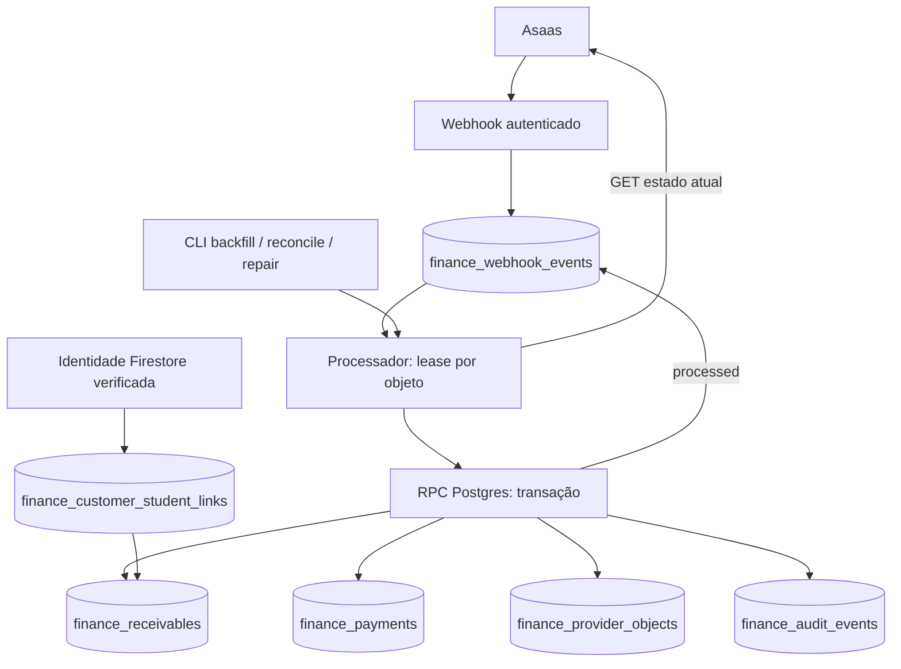

# Financial Foundation — Fase 0

**Data:** 14/09/2026 (execuções também registradas em 15/09 UTC).  
**Especificação:** [auditoria financeira](finance-architecture-audit.md).  
**Estado:** implementação e integração local verificadas; **homologação Asaas sandbox pendente de credenciais**. Não está liberada para produção nem certificada como base pronta para a Fase 1.

**Homologação posterior:** consultar [relatório de certificação](finance-foundation-certification.md). A CLI recebeu os controles adicionais descritos abaixo; a ausência de ambiente comprovado mantém o resultado NO-GO.

## 1. Escopo entregue e decisão de schema

Implementamos cliente Asaas centralizado, health server-side, inbox durável, processador, projeções de cobranças/pagamentos/customers/assinaturas, vínculos explícitos de alunos, backfill, reconciliação manual, repair por ID, auditoria e retry. A UI Financeiro, sidebar, Firestore, Chatwoot e automações não foram alterados.

A auditoria demonstrou incompatibilidade das tabelas financeiras legadas e semântica acadêmica nas `subscriptions` de Retenção. Por isso a migration é **aditiva** e cria projeções `finance_*`. Não renomeia, altera constraints nem migra dados de `n8n_*`, `charges`, `payments` ou `subscriptions` existentes. Esses modelos continuam legados/operacionais; a nova projeção Asaas será a fonte de leitura financeira da Fase 1. Não há dual write da foundation nas tabelas antigas.

`connections` é compartilhada com o contrato atual de Atendimento: `connection_id`, provider, external_account_type/id, display_name, status, metadata, timestamps. A migration funciona isoladamente e, se a tabela já existir, a reutiliza. Asaas usa `external_account_type = asaas:<environment>` para separar sandbox/produção; nenhum token vai para essa tabela. O registro `finance_connection_state` estende apenas a conexão Asaas. A coexistência com a migration de Atendimento foi testada em banco local, sem implementar fluxos de Atendimento.

### Diagrama



## 2. Arquivos

### Criados

| Arquivo | Responsabilidade |
| --- | --- |
| `api/_lib/asaas-webhook-legacy.js` | Handler anterior preservado como caminho de compatibilidade |
| `api/_lib/finance-domain.js` | Normalização, validação, hash, allowlist de eventos e comparação |
| `api/_lib/finance-store.js` | Fronteira da RPC e sanitização de erros de storage |
| `api/_lib/finance-foundation.js` | Health, ingestão, processamento, retry, drain, sync, repair e vínculo |
| `api/finance-foundation.js` | API administrativa de health/manutenção |
| `scripts/finance-foundation.js` | CLI controlada, dry-run padrão e apply bloqueado fora de sandbox/staging |
| `scripts/finance-sandbox.env.example` | Template de ambiente privado, sem credenciais |
| `supabase/migrations/202609140002_finance_foundation.sql` | Schema, constraints, RPC transacional, leases, auditoria e permissões |
| `tests/finance-asaas.test.js` | Cliente HTTP/health/paginação/erros |
| `tests/finance-foundation.test.js` | Domínio, autenticação, endpoint administrativo, segurança da CLI |
| `tests/finance-sql-integration.test.js` | Transações, concorrência, idempotência, repair e permissões com banco real |
| `tests/helpers/finance-postgres.js` | PostgreSQL/PostgREST descartáveis em Docker, sem credenciais externas |
| `docs/finance-foundation.md` | Este runbook |

### Alterados

- `api/_lib/asaas.js`: cliente central com timeout, validação da base, redirects proibidos, erros sanitizados, paginação e account health.
- `api/_lib/finance-integrations.js`: base Asaas explícita, sem fallback silencioso para sandbox; ausência de API Key reportada sem depender das demais integrações.
- `api/asaas-webhook.js`: seletor de rollout + ingress durável e processamento opcional aguardado.
- `.env.example`, `.env.staging.example`: flags e token dedicado da foundation.

Há trabalho concorrente no checkout em Atendimento/Comercial; a lista acima descreve somente as alterações desta tarefa. Não foi feito commit/deploy nem aplicada migration em banco externo.

## 3. Schema e constraints

| Tabela | Identidade e contrato |
| --- | --- |
| `connections` | PK UUID connection_id; unique(provider, external_account_type, external_account_id); reutilizada |
| `finance_connection_state` | PK/FK connection_id; environment sandbox/production; health/último sucesso/reconciliação |
| `finance_webhook_events` | PK UUID; unique(connection_id, dedupe_key) e índice único parcial de provider_event_id; payload reduzido/hash; status, tentativas, horários, erro e lease |
| `finance_object_leases` | PK(connection_id, resource, external_object_id); token UUID + expiração; serializa a consulta/aplicação remota por objeto |
| `finance_provider_objects` | UUID; unique(connection_id, resource, external_object_id); recurso customer/subscription; snapshot allowlisted e timestamps |
| `finance_customer_student_links` | PK(connection_id, asaas_customer_id, firestore_doc_id); verificado por/em; suporta pagador com vários alunos |
| `finance_receivables` | UUID; unique(connection_id, asaas_payment_id); customer/subscription IDs, status bruto/operacional, valor decimal, vencimento date, método, deleted e snapshot |
| `finance_payments` | UUID; receivable_id único, FK composta garantindo mesmo connection/payment; unique(connection_id, asaas_payment_id); status, valor, datas e estorno |
| `finance_audit_events` | UUID append-only; origem, ator, objeto externo, ação, before/after reduzidos, correlação e timestamp |
| `finance_sync_runs` | UUID; recurso/origem/filtros, modo, progresso/offset, relatório, erro, início/fim |

Unicidade externa é **por conexão**, impedindo colisão entre contas e ambientes. UUID local nunca é derivado de nome, email ou posição em lista. Nenhum ID de conta/aluno real foi fixado no código.

Todos os `finance_*` têm RLS habilitada; sem grants para anon/authenticated. Service role recebe leitura das tabelas e EXECUTE da RPC, **não INSERT/UPDATE/DELETE diretos**. `finance_rpc` é SECURITY DEFINER, com search_path fixo; a superfície HTTP impõe sessão admin. Credenciais de service role permanecem server-side. O proprietário do banco continua sendo um administrador privilegiado, como em qualquer migration; não tratamos DBA como usuário de aplicação.

`finance_audit_events` tem trigger que impede UPDATE/DELETE. Não há DROP de tabelas ou exclusão de registros na migration. DELETE dentro da RPC remove apenas leases efêmeros após uso, nunca dados financeiros. A migration pode ser reaplicada: criação e índices idempotentes e função substituída com assinatura estável.

### Transação

A RPC `commit` verifica token/expiração do lease e vínculo do evento; atualiza recebível, pagamento/settlement, auditoria e status processed **no mesmo commit**. Falha em qualquer etapa faz rollback de todas. Marcar failed é uma segunda transação: se essa também falhar, a lease expira e o worker retoma. O teste força falha na inserção de auditoria e comprova ausência de cobrança/pagamento parciais.

## 4. Cliente e health Asaas

`createAsaasClient()` / `checkAsaasConnection()`:

- Somente bases oficiais explícitas: `https://api-sandbox.asaas.com/v3` ou `https://api.asaas.com/v3`.
- GET, POST, PUT e DELETE; PATCH rejeitado, pois os endpoints v3 usados adotam PUT. Nenhum comando financeiro de saída foi disponibilizado na UI/API nesta fase.
- Timeout padrão 10 segundos por chamada, cobrindo leitura do corpo; redirects recusados para evitar encaminhar credencial a outro host.
- `access_token` e User-Agent server-side; não permite sobrescrever headers de autenticação pelo chamador.
- Parse JSON e classificação de 401, 403, 404, 429, 5xx, timeout/rede e corpo inválido. Não retém descrição/payload de erro remoto, tokens ou header no objeto de erro.
- Não faz retry cego de POST/PUT/DELETE. Retry de ingestão/reparo ocorre explicitamente pelo processador, em operações de leitura.
- Health consulta `GET /myAccount/accountNumber` e valida **agency, account, accountDigit**, conforme schema oficial. Retorna configured, reachable, authenticated, account_accessible, environment, account_reference, checked_at e error sanitizado.
- Conta bancária e ambiente retornados são confrontados com a conexão registrada antes de processar/sincronizar. Trocar API Key para outra conta não pode contaminar a projeção existente.

`GET /api/finance-foundation` é restrito a admin e retorna health + métricas persistidas. Não é uma tela de Conexões. Sem connection_id, o health interno/CLI ainda diagnostica configuração Asaas; sem chave, não faz chamada remota.

Observação: health bem-sucedido valida acesso à conta, não garante todas as permissões de todos os endpoints. Cada operação financeira trata seus próprios erros.

## 5. Inbox e fluxo do webhook

Com `FINANCE_FOUNDATION_ENABLED=true`, `/api/asaas-webhook`:

1. Aceita POST e autentica exclusivamente `asaas-access-token` contra `ASAAS_WEBHOOK_TOKEN`.
2. Não aceita query token/secret, Bearer ou fallback n8n no caminho novo.
3. Limita corpo a 256 KiB, valida JSON/identidade e normaliza envelope.
4. Persiste por RPC e deduplica atomicamente. Não consulta Asaas antes de assegurar a persistência.
5. Retorna 200 depois de durabilidade; mesmo ID com conteúdo financeiro divergente retorna 409 e registra conflito.
6. Se `FINANCE_WEBHOOK_PROCESS_INLINE=true`, aguarda tentativa de processamento antes de encerrar; erros posteriores à persistência retornam sucesso de ingestão com diagnóstico resumido, preservando fila.
7. Com processamento inline desativado, operação process/drain deve ser executada por worker/operador. **Nenhum scheduler automático foi instalado.**

Se banco/persistência falhar, responde erro não-2xx. Nenhuma promessa fica solta após o request serverless; se a função morrer, o evento já persistido pode ser retomado.

### Dados preservados

Inbox guarda evento/ID do objeto/dateCreated e campos financeiros allowlisted, hash SHA-256 e metadados de processamento. Exclui token, authorization, API Key, nome, email, CPF, telefone, descrição livre e links da cópia do evento. Não guarda envelope bruto completo. URLs ficam somente na projeção, para uso futuro autorizado. Customer projection guarda nome/email mínimos, sem CPF/telefone/cartão ou secrets. O hash é da representação normalizada reduzida, não do JSON bruto recebido.

Próxima política operacional a definir antes de produção: prazo de retenção/purga de inbox e snapshots conforme necessidade de auditoria. Nenhuma purga automática foi criada.

## 6. Idempotência

- Chave preferencial: `(connection_id, provider_event_id)`; dedupe_key `event:<id>`.
- Sem ID: `hash:<sha256(envelope normalizado)>`, incluindo tipo, objeto, data do provedor e atributos financeiros. A mesma informação repetida não ganha efeito novo.
- Hash estável com ordenação de chaves; campos pessoais/secrets desconhecidos não alteram a chave.
- Mesmo ID com hash financeiro diferente preserva o primeiro registro e cria auditoria de conflito, sem sobrescrita silenciosa.
- Advisory lock cobre a corrida de primeira inserção; índice único é a proteção final.
- Processed/ignored não são reaplicados no retry normal.
- Recebível único por connection/payment; settlement único por recebível, nunca por event ID.
- Reaplicar backfill com snapshot igual não gera novo evento de negócio na auditoria. Timestamps de observação/health são telemetria e podem avançar.

Sem provider_event_id e sem dateCreated, duas notificações semanticamente idênticas não são distinguíveis. Isso não perde o estado atual porque a sincronização usa consulta remota; não prometemos reconstruir a cronologia completa do provedor a partir de envelopes sem identidade.

## 7. PAYMENT_CREATED e processamento dos eventos

`PAYMENT_CREATED` agora entra na inbox e dispara GET da cobrança; um UPSERT cria `finance_receivables`, mesmo sem aluno vinculado. Repetição mantém a mesma cobrança.

Eventos essenciais atendidos: CREATED, UPDATED, CONFIRMED, RECEIVED, OVERDUE, DELETED, REFUNDED, CHARGEBACK_REQUESTED e CHARGEBACK_DISPUTE. Também há encaminhamento para releitura em RESTORED, eventos de estorno parcial/processamento/negado, desfazer dinheiro, autorização/risco, falha de captura, antecipação e outros listados em `PAYMENT_EVENTS`. Customer e subscription usam o mesmo mecanismo de consulta/projeção por recurso.

O tipo do evento **não inventa um status**: o snapshot atual da API fornece status bruto; `deleted=true` é preservado e gera estado operacional DELETED. Restante dos status não é reduzido a quatro rótulos locais. Tipos desconhecidos são persistidos e classificados ignored/unsupported com auditoria; não descartados sem evidência.

### Exclusão e 404

Se o GET retorna objeto com deleted=true, projetamos tombstone e preservamos histórico. Se retorna 404, não é possível provar apenas pelo HTTP se houve deleção, ID incorreto ou indisponibilidade daquele recurso: evento fica failed visível com `asaas_not_found`, sem apagar/inventar cobrança. **O comportamento real de consulta de cobranças excluídas na conta sandbox precisa ser homologado.** Não declaramos o cenário de exclusão externa aprovado apenas porque um fixture local funcionou.

## 8. Ordenação e concorrência

Não há ranking arbitrário “pago vence pendente”. Antes de cada atualização, o worker:

1. Adquire lease por connection/resource/external ID, com token aleatório e validade de 60 segundos.
2. Consulta o objeto atual no Asaas, já sob exclusividade local daquele objeto.
3. Envia snapshot + token para a RPC transacional.
4. RPC recusa token expirado ou substituído.

Evento UPDATED antigo depois de RECEIVED consulta novamente Asaas e preserva RECEIVED. Se o provedor legitimamente desfizer uma baixa ou restaurar cobrança, o estado atual pode mudar: isso é permitido e auditado. Datas de evento são preservadas como evidência, não usadas para ordenar cegamente.

Backfill/apply e repair usam o **mesmo lease**. O snapshot da listagem serve para comparar; a escrita relê por ID sob lease, evitando aplicar página antiga sobre webhook novo. Um processo lento cujo lease expire não pode fazer commit após o sucessor.

Limite: se a própria leitura Asaas apresentar consistência eventual, a projeção reflete o que o provedor forneceu naquele momento. Webhook/reconciliação posterior converge; não afirmamos atomicidade entre bancos/provedor. Chamadas adicionais de leitura custam quota e latência, uma escolha conservadora para esta foundation.

## 9. Pagamentos e identidade

`finance_receivables` representa o objeto payment/cobrança Asaas. `finance_payments` representa **um settlement atual desse mesmo objeto**, com FK, value, status, billing_type, payment_date, confirmed_date e refund_value. Não é um ledger contábil completo de múltiplos movimentos.

- CONFIRMED cria/atualiza settlement confirmado, sem tratar confirmação como saldo disponível.
- RECEIVED atualiza a mesma linha; não insere segunda receita.
- REFUNDED/chargeback/deleted não removem histórico nem mantêm uma linha contando como RECEIVED; estado atual é atualizado.
- Data ausente permanece nula, sem substituir por “agora”.
- Refunds só são somados quando o item recebido declara status DONE; solicitações pendentes não viram dinheiro estornado. Se API não fornece detalhe suficiente, valor de estorno pode ser desconhecido. Homologar formatos/casos parciais antes de relatórios de caixa.
- Valores JS são normalizados como decimal textual, com validação; Postgres armazena numeric. Não somamos dinheiro com float JS.

Alunos vêm somente de `finance_customer_student_links`, com customer ID + document ID Firestore verificados. Nenhum vínculo automático por nome/email/CPF. A CLI link-customer consulta customer remoto e `users/<id>` Firestore, exige tipo de aluno e registra ator. Não usa o campo id interno do documento como substituto de firestoreDocId. Um pagador pode vincular vários alunos: getter retorna student_refs, sem escolher arbitrariamente um. Sem vínculo, a lista é vazia e reconciliation registra UNMATCHED_CUSTOMER.

Não importamos automaticamente referências textuais existentes nos legados. Transferência/remoção/revisão de vínculos e alocação de valores por aluno são operações posteriores, não sincronização de fatos Asaas.

## 10. Backfill, reconciliation e repair

### Backfill

CLI com dry-run padrão. Enumera payments/customers/subscriptions com offset/limit e hasMore; limite máximo por página 100; protege resposta inválida, falta de progresso e número máximo de páginas. Dedupe por ID no run, UPSERT no banco e checkpoint após lote commitado.

Apply relê cada objeto por ID antes de gravar. Se falhar no meio do lote, run fica failed com último offset concluído; repetir desde esse offset é seguro. Não apaga registros locais ausentes da listagem. Pode repetir a varredura por completo sem duplicar projeção.

Dry-run faz apenas leitura de API/banco e retorna relatório em stdout: **não escreve projeção, health, audit ou sync_runs**. Apply persiste run/progresso/resultado. Issues detalhadas limitadas a 1.000 por relatório, com flag de truncamento; contadores incluem todos os examinados.

### Incremental reconciliation

Mesmo motor, origem ASAAS_RECONCILIATION, com janelas explícitas documentadas: criação, pagamento ou vencimento e filtros de status/customer/subscription conforme recurso. Não existe parâmetro invented updatedAt/since: criação recente não captura todo estorno antigo.

Classificações: MATCH, MISSING_LOCAL, STATUS_MISMATCH, VALUE_MISMATCH, DUE_DATE_MISMATCH, UNMATCHED_CUSTOMER e DETAIL_MISMATCH. Comparação também verifica colunas tipadas do recebível, detectando alteração local de status/valor/vencimento mesmo se snapshot JSON não mudou.

Apply corrige campos do provedor, preservando vínculos Space. Não “repara” UNMATCHED_CUSTOMER por heurística. last_reconciliation avança apenas quando run de reconciliação apply conclui.

Esta fase não instala scheduler, não varre automaticamente IDs ausentes da listagem remota, nem garante visão consistente de offset em conta que muda durante o scan. Operação recomendada: janelas limitadas, replay e segunda passagem; executar reconciliação histórica periódica depois de dimensionar volume/quota. Recursos excluídos/ausentes e permissões precisam de diagnóstico por ID. Comparação de ledger contábil completo/relatórios de caixa pertence a etapas posteriores.

### Repair por ID

`repairPaymentById(id, { dryRun, actor })`: verifica conta, busca ID, compara em dry-run; em apply adquire lease, busca novamente, normaliza, UPSERT de recebível+settlement e audit ASAAS_REPAIR. Suporta reconstruir cobrança local ausente e corrigir colunas alteradas em cenário controlado. Não cria cobrança remota nem chama POST /payments.

## 11. Retry, falhas e observabilidade

- Limite de **5 tentativas por evento**, imposto também no banco.
- Retry transitório: backoff exponencial de 30, 60, 120, 240 e 480 segundos, sem loop dentro do request.
- Rede, timeout, 429, 5xx, resposta inválida e falha de storage são classificados para recuperação; erro permanente/404 não é automaticamente repetido.
- Lease expirada permite retomar tentativa interrompida. Crash na quinta tentativa é convertido em failed/finance_attempts_exhausted quando a fila é examinada.
- Retry manual respeita prazo, limite e classificação; não zera attempt_count. Falhas permanentes/exaustas continuam visíveis; repair pode corrigir o objeto sem apagar a falha histórica.
- Falha de health antes da aquisição mantém evento pending e registra problema na conexão. Não consome tentativa de aplicação que nem começou.
- `retryWebhookEvent`, `drain` e CLI process são mecanismos controlados; não há cron instalado.
- Retry-After específico do provedor e limitação global de throughput ainda não estão implementados; limite conservador e janela de execução devem ser definidos na homologação. Nunca repetir comando de criação remota automaticamente.

Logs JSON: domain/action/event_id/resource/external_object_id/changed/error code. Não logam valor financeiro, nome, CPF, tokens, payload ou resposta remota integral. Logs de entrada e status da inbox permitem rastrear recebido/processado/failed/ignored/reprocessado.

Health futuro de Conexões já dispõe de environment, connection_health, last_successful_api_call, last_webhook_received, last_webhook_processed, pending_events, failed_events e last_reconciliation. Última chamada persistida corresponde às operações observadas de health/apply; dry-runs não alteram telemetria. Ausência de evento recente não significa webhook quebrado. Ainda não verifica configuração/fila externa do webhook no Asaas.

## 12. Auditoria e fontes concorrentes

Auditoria inclui source ASAAS_WEBHOOK / ASAAS_BACKFILL / ASAAS_RECONCILIATION / ASAAS_REPAIR / SYSTEM / ADMIN_USER, actor, object_type, external_object_id, action, before/after, correlation_id e created_at. O source SPACE_COMMAND fica reservado para Fase 2; não há comando remoto monetário nessa fase.

Antes/depois excluem nome/email e URLs; não duplicam payload integral. Settlement e recebível têm mudanças auditadas; reentrega sem mudança não multiplica histórico de negócio. Retry/falha/conflito/ignored/vínculo/configuração têm trilha própria. Timestamps de observação, locks e progresso são telemetria, não eventos monetários.

### LEGACY preservado

- `/api/financeiro-dashboard`: save_aluno, save_cobranca, confirm_cobranca, link_conversation.
- `/api/financeiro-cobrancas`: salvamento local e confirmação manual.
- `/api/chatwoot/conversation` e UI de conversas.

Esses endpoints continuam no contrato antigo por risco de regressão. **Não leem/escrevem as novas tabelas**, cujas permissões impedem mutação direta por service role. Portanto não contaminam a projeção canônica, mas ainda podem divergir do Asaas nas tabelas antigas. Não apresentamos essa coexistência temporária como ownership resolvido para toda a plataforma.

Na Fase 1, a UI deve consultar a projeção nova. Na Fase 2, substituir as mutações legadas por comandos Asaas autorizados/idempotentes; decidir recebimentos fora do Asaas e fazer corte explícito dos escritores antigos. Não ligar dual write entre os dois modelos para “atualizar o dashboard”.

## 13. Configuração e comandos

### Variáveis

| Variável | Uso |
| --- | --- |
| ASAAS_BASE_URL | Base oficial explícita |
| ASAAS_API_KEY | Segredo server-side |
| ASAAS_WEBHOOK_TOKEN | Segredo dedicado ao header do webhook novo |
| FINANCE_CONNECTION_ID | UUID retornado pelo init, referência à conta/ambiente verificados |
| FINANCE_FOUNDATION_ENABLED | false padrão; true habilita webhook/API novos |
| FINANCE_WEBHOOK_PROCESS_INLINE | true para tentar processar imediatamente; false exige drain/worker |
| SUPABASE_URL / SUPABASE_SERVICE_ROLE_KEY | REST/RPC do banco alvo, server-side |
| SPACE_STAGING_SUPABASE_URL | Referência explícita obrigatória para apply da CLI; deve coincidir com SUPABASE_URL |
| SPACE_PRODUCTION_SUPABASE_URL | Referência de produção usada para impedir alvo indevido |
| FINANCE_STAGING_PROJECT_REF | Ref staging previamente aprovada em config/finance-staging-targets.json |
| SPACE_PRODUCTION_PUBLIC_BASE_URL | Origem de produção conhecida, conferida contra a política aprovada |
| FINANCE_SANDBOX_WEBHOOK_URL | Endpoint exato de webhook no domínio staging aprovado |
| FINANCE_STAGING_APPLY | YES explícito, além de --apply e --actor, para operações que gravam |
| APP_ENV, SPACE_APP_ENV, ASAAS_KEY_SCOPE e configuração Firebase staging | Contrato de isolamento já existente da plataforma |
| SPACE_PUBLIC_BASE_URL / SPACE_AUTH_SECRET | Sessão/origin para a API administrativa |

A CLI **não carrega `.env.local` automaticamente**. Use arquivo privado ignorado e `node --env-file=...`; nunca coloque secret no comando/README/log. Template em `scripts/finance-sandbox.env.example`. Validadores de staging do projeto também exigem Firebase staging separado, mesmo que o fluxo não escreva Firestore.

Todas as operações da CLI, inclusive health/dry-run, agora exigem alvo e domínio em allowlist independente, APP_ENV/SUPABASE_ENV_SCOPE=staging, ASAAS_KEY_SCOPE=sandbox e hashes das credenciais previamente revisados. A allowlist começa vazia, sem autorização implícita. Preflight é offline e não certifica o deploy. Health com FINANCE_CONNECTION_ID grava telemetria: exige --apply, --actor e FINANCE_STAGING_APPLY=YES. Sem connection ID, o health remoto é somente leitura, mas também exige a configuração sandbox aprovada. O health interno do cliente continua disponível para testes de ausência de configuração.

### Sequência de ativação em sandbox

1. Criar arquivo privado `.env.finance-sandbox` a partir do template, preencher credenciais nos mecanismos locais de segredo e confirmar banco staging separado.
2. Aplicar **somente após confirmar alvo** a migration `202609140002_finance_foundation.sql` pelo mecanismo SQL de staging. Esta tarefa não executou esse passo remotamente.
3. Executar health. Não prosseguir se account_accessible for false.
4. Executar init apply em sandbox/staging e copiar o UUID retornado para FINANCE_CONNECTION_ID. Não criar ID manual fixo.
5. Habilitar flags apenas nesse deploy staging. Configurar webhook Asaas sandbox para URL staging, com o token dedicado e eventos necessários.
6. Validar os cenários da seção 14 antes de qualquer rollout de produção.

```sh
node --env-file=.env.finance-sandbox scripts/finance-foundation.js preflight
node --env-file=.env.finance-sandbox scripts/finance-foundation.js health
node --env-file=.env.finance-sandbox scripts/finance-foundation.js init --apply --actor operador-uid
node --env-file=.env.finance-sandbox scripts/finance-foundation.js backfill --dry-run
node --env-file=.env.finance-sandbox scripts/finance-foundation.js backfill --resource customers --dry-run
node --env-file=.env.finance-sandbox scripts/finance-foundation.js backfill --resource subscriptions --dry-run
node --env-file=.env.finance-sandbox scripts/finance-foundation.js backfill --apply --actor operador-uid
node --env-file=.env.finance-sandbox scripts/finance-foundation.js reconcile --due-from 2026-09-01 --due-to 2026-09-30 --dry-run
node --env-file=.env.finance-sandbox scripts/finance-foundation.js reconcile --apply --actor operador-uid
node --env-file=.env.finance-sandbox scripts/finance-foundation.js repair PAYMENT_ID --dry-run
node --env-file=.env.finance-sandbox scripts/finance-foundation.js repair PAYMENT_ID --apply --actor operador-uid
node --env-file=.env.finance-sandbox scripts/finance-foundation.js process --limit 20 --apply --actor operador-uid
node --env-file=.env.finance-sandbox scripts/finance-foundation.js retry INBOX_UUID --apply --actor operador-uid
node --env-file=.env.finance-sandbox scripts/finance-foundation.js link-customer CUSTOMER_ID FIRESTORE_DOC_ID --apply --actor operador-uid
```

Substituir parâmetros em maiúsculas pelos IDs reais **do teste sandbox**. Apply exige ator e é rejeitado se Asaas não for sandbox ou se banco não coincidir com referência staging. Não existe flag de bypass para apply de produção nesta CLI. Dry-run e apply simultâneos são inválidos.

Antes da sequência, revisar e preencher a allowlist com evidência administrativa independente de ref/domínio/credenciais staging; não copiar hashes do arquivo alvo e tratar isso como prova. FINANCE_STAGING_APPLY deve ser habilitada explicitamente pelo operador somente para a operação aprovada. Após init, usar `health --apply --actor operador-uid` para persistir o diagnóstico da conexão.

Paginação: `--offset N`, `--max-pages N`, `--resource payments|customers|subscriptions`. Retomar último offset concluído do run failed, ou reiniciar integralmente. Além de due-from/to há created-from/to e status. Não filtrar customer/subscription com filtros não documentados para aquele recurso.

### API de suporte

- GET `/api/finance-foundation`: admin, feature flag, health.
- POST action `repair`, payment_id, apply boolean: preview padrão; apply explícito.
- POST action `retry`, event_id: tentativa controlada.
- POST action `process`, limit: drain limitado a 20 por request.
- Mutações exigem admin UID e header Origin igual ao SPACE_PUBLIC_BASE_URL; não são endpoint público para scheduler.
- Bulk backfill/reconciliation continuam CLI-only para não exceder limites serverless. Não foram criadas rotas de criação/edição/cancelamento remoto.

Se processar inline exceder o tempo de execução do deploy, manter ingestão durável e executar worker/drain com janela adequada. Validar limite do provedor de hosting antes de ativar produção; não há alteração de vercel.json nesta tarefa.

### Consultas de diagnóstico (somente ambiente autorizado)

```sql
select id, event_type, external_object_id, processing_status, attempt_count,
       received_at, processed_at, available_at, last_error
from public.finance_webhook_events
where connection_id = :connection_id
order by received_at desc;

select id, source, resource, status, next_offset, report, last_error
from public.finance_sync_runs
where connection_id = :connection_id
order by started_at desc;

select source, actor, object_type, external_object_id, action, correlation_id, created_at
from public.finance_audit_events
where connection_id = :connection_id
order by created_at desc;
```

Os placeholders são parâmetros do cliente SQL, não SQL pronto para interpolação por shell. Evitar SELECT payload para suporte rotineiro.

## 14. Testes, evidência e critérios de homologação

### Executado nesta tarefa

1. Testes do cliente/domínio/APIs/CLI e suíte relacionada a ambiente/identidade/Retenção: **61 passaram, 0 falhas, 0 skipped**, usando RUN_RETENTION_BACKEND_LOCAL=1.
2. Integração com **PostgreSQL 16 e PostgREST 12 reais em Docker local**, Asaas simulado: **20 testes/subtestes passaram**, incluindo 19 cenários. Banco local descartável, sem credencial de produção. Migration aplicada/reaplicada apenas nele.
3. Health real do ambiente disponível: configured=false, erro asaas_not_configured. Isso valida diagnóstico local de ausência, **não conectividade com Asaas**.

```sh
RUN_RETENTION_BACKEND_LOCAL=1 node --test \
  tests/finance-asaas.test.js tests/finance-foundation.test.js \
  tests/staging-env.test.js tests/student-ownership.test.js \
  tests/retention-domain.test.js tests/retention-cases-api.test.js tests/retention-backend-local.test.js

RUN_FINANCE_SQL_INTEGRATION=1 node --test tests/finance-sql-integration.test.js
```

O harness exige Docker e imagens locais `postgres:16-alpine` e `postgrest/postgrest:v12.2.8`; nunca usa URL externa de banco. Sem flag, teste SQL fica skipped explicitamente, não é aprovado por simulação. Configurar ambiente de CI para executar essa suíte obrigatoriamente antes do rollout.

Cobertura comprovada: autenticação/body, persistência/ACK, first delivery concorrente 20 vezes, múltiplos processadores, create/update/overdue/confirmed/received/deleted/refund/chargeback/restored, rollback por falha de audit, retries/limite/crash, fencing de lease, paginação/dry-run/apply repetido, mismatch/reparo, exclusão local e reconstrução, vínculo conhecido/desconhecido, conflito de conta, privilégios, audit imutável, eventos desconhecidos e coexistência de migrations.

### Não validado externamente

Não existem ASAAS_API_KEY/BASE_URL/WEBHOOK_TOKEN/FINANCE_CONNECTION_ID preenchidos no ambiente inspecionado nem credenciais staging Asaas disponibilizadas. Não foram criados clientes/cobranças externas, registrados webhooks, pagos/estornados recursos ou executado backfill/apply remoto. O banco Supabase localmente configurado não foi presumido como staging.

Homologação obrigatória, usando dados sintéticos sandbox:

| Cenário | Evidência a coletar |
| --- | --- |
| Criar cobrança no painel/API Asaas | external ID → delivery → inbox processed → uma projeção |
| Alterar valor/vencimento | Snapshot atual, mudança e audit; valor/due corretos |
| Vencer | Evento real/sandbox suportado e status OVERDUE |
| Confirmar/receber | Distinção de estados; uma linha de pagamento, datas reais |
| Excluir/restaurar | Comportamento real GET deleted/404, tombstone e histórico |
| Estornar/chargeback/parcial | Formato real de status/refunds; sem dupla receita |
| Reenviar | Mesmo event ID, sem duplicar cobrança/pagamento/audit de negócio |
| Corromper/apagar local em banco descartável | Reconciliação detecta e repair restaura |
| Interromper processamento | Lease expira; retry recupera sem efeito duplicado |
| Trocar conta/ambiente indevidamente | Rejeição de mismatch e ausência de escrita |

Para testar recebimentos/cancelamentos use somente operações oficialmente suportadas no sandbox e preserve evidências sanitizadas de IDs/status. Não converter o teste local com respostas simuladas em alegação de homologação externa.

## 15. Limitações e próximo passo

- Homologação externa e migration em staging pendentes; **não considerar a Fase 0 operacionalmente concluída**.
- Frontend continua lendo legado. A nova projeção não aparece nele nesta fase; nenhuma renomeação/refatoração visual foi feita.
- Métodos monetários legados ainda existem; seu corte é planejado, não feito abruptamente.
- GET 404 de objeto excluído precisa de validação real; não há fallback que inventa deletion.
- Não há scheduler/worker hospedado, dead-letter UI, restrição global de quota/Retry-After ou alerta externo. Há fila, limites, replay e diagnósticos controlados.
- Settlement não é ledger de todos os movimentos; estornos parciais/refunds, taxas e disponibilidade de caixa devem ser homologados antes de analytics.
- Reconciliation cobre registros enumerados/janelas; não detecta automaticamente todos os locais ausentes do remoto nem elimina registros. Full coverage sob paginação concorrente exige passagens de verificação.
- Customer/subscription projection é enxuta e independente de matrícula; ausência de identidade fica unmatched.
- Políticas globais de retenção/backup/TTL e inventário dos escritores n8n externos continuam necessárias antes do corte de produção.

**Recomendação para Fase 1:** o código fornece a base e os contratos de leitura para desenvolver contra fixtures/staging, mas o gate de iniciar a V1 sobre dados reais permanece fechado até concluir os cenários Asaas sandbox acima. Próximo passo concreto: configurar sandbox + Supabase staging, aplicar migration lá, registrar conexão/webhook e executar o roteiro com evidências.

## 16. Rollback de ativação

A migration não tem down destrutivo. Para rollback de rollout, interromper o worker, desativar FINANCE_FOUNDATION_ENABLED e preservar tabelas/inbox/auditoria para diagnóstico. Isso retorna ao handler legado e suas limitações; eventos que chegarem durante o período legado devem ser reconciliados antes de reativar a foundation. Preferível manter inbox ativa e desativar somente processamento inline quando a falha estiver no worker.

Não apagar tabelas ou restaurar status antigos como rollback. Nenhum escritor novo altera Firestore, Retenção, Chatwoot ou as tabelas financeiras antigas. Retirada física de estrutura exige plano posterior de dados/backups e autorização própria.

## Referências oficiais consultadas

- [Número da conta autenticada e schema agency/account/accountDigit](https://docs.asaas.com/reference/recuperar-numero-de-conta-no-asaas).
- [Consulta de cobrança por ID](https://docs.asaas.com/reference/recuperar-uma-unica-cobranca).
- [Listagem de cobranças e filtros](https://docs.asaas.com/reference/listar-cobrancas).
- [Eventos de cobrança](https://docs.asaas.com/docs/webhook-para-cobrancas).
- [Listagem de assinaturas](https://docs.asaas.com/reference/list-subscriptions).
